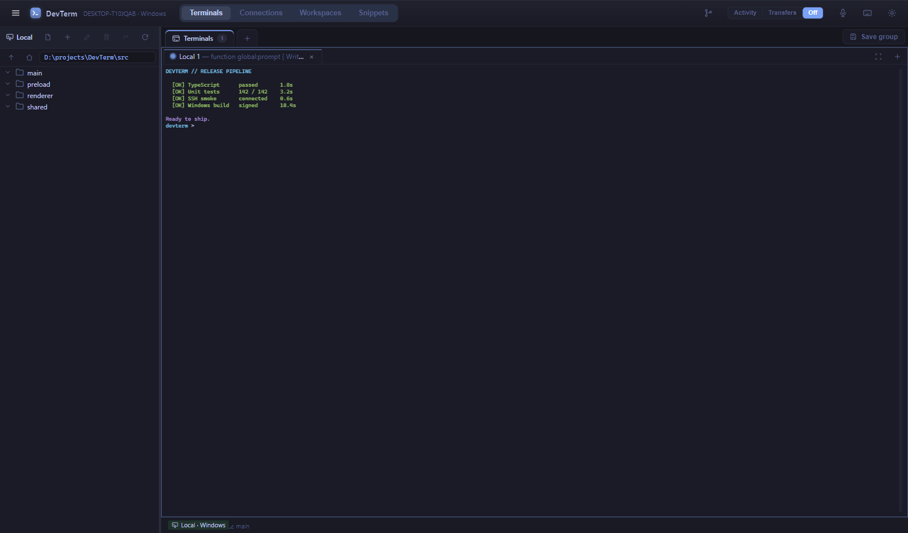
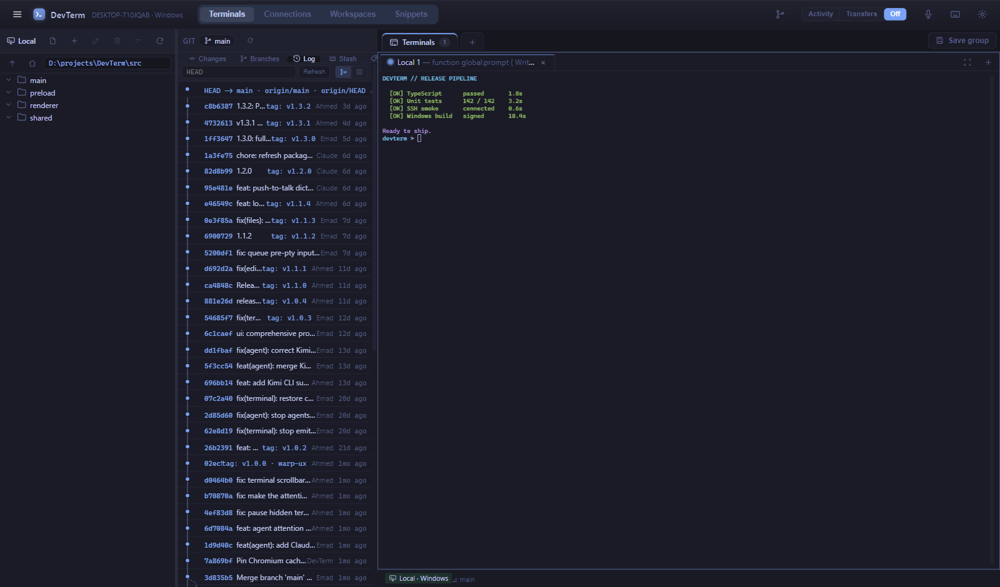
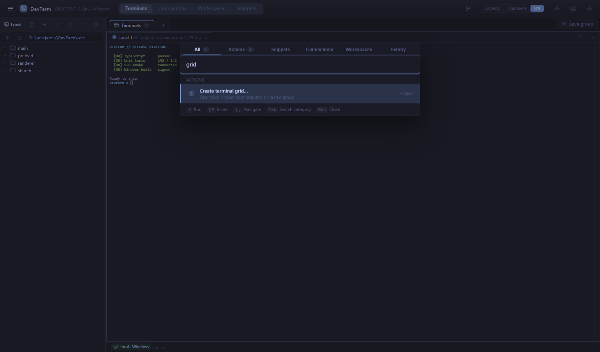
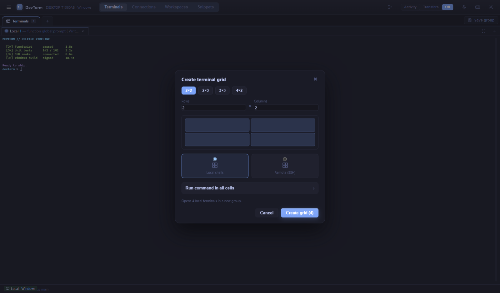

# DevTerm

<p align="center">
  
</p>

<p align="center">
  <strong>The Windows terminal for local machines and remote SSH hosts, with AI coding agents that never land on the server.</strong><br>
  Tiling panes, SFTP, git, preview/annotate, and a built-in multi-provider agent. Remote hosts need nothing installed and no outbound internet.
</p>

<p align="center">
  <a href="https://github.com/AEmad99/devterm/releases/latest"></a>
  <a href="./LICENSE"></a>
  
</p>

DevTerm is a normal framed Windows app. You open it and you are in a terminal — local PowerShell, SSH, or both — with splits, groups, a file sidebar, an editor, an in-app browser, and an agent that can work on the connected host through the same SSH session.

**Current release: [v1.4.1](https://github.com/AEmad99/devterm/releases/tag/v1.4.1)**



---

## Why it exists

Most agent terminals either install a runtime on the server or send host work out through the model vendor. DevTerm keeps the agent on your machine and reaches the remote through an in-process MCP bridge on the **same** ssh2 connection as the shell and SFTP. The server stays a normal SSH host.

---

## What you get

- **Local and SSH terminals** — PowerShell (or cmd / a custom shell) locally; password, key file, or system OpenSSH agent. ProxyJump of up to two extra hops (three including the target). POSIX remotes with a working tmux get a live session picker.
- **Tiling panes and groups** — split any pane, drag to resize, and keep independent named groups. Launch a 4×4 remote grid when you need a wall of shells. Hidden groups can hibernate their renderer terminals after 30s while PTYs and SSH stay alive.
- **Saved connections and workspaces** — OS-keychain secrets, `~/.ssh/config` import (including ProxyJump lists), local-only tags (`prod`, `homelab`, …), and workspace snapshots of a group's hosts, folders, and split tree.
- **Files, SFTP, and an editor** — a sidebar that follows `cd`, a dual-pane transfer browser with a persistent queue that can resume mid-file, and CodeMirror 6 (Markdown Edit / Side / Preview).
- **Git panel** — status, stage, commit, push/pull, branches, stash, tags, remotes, and a commit graph. Remote repos reuse the session's SSH exec channel. Agents can call read-only `git_status` / `git_diff`.
- **In-app browser and Preview** — tabbed http(s) panes for docs and dashboards. Preview localhost, a forwarded port, or a local folder; pin/rectangle/comment overlays send to the pane agent. Agents drive both through `browser_*` and `preview_*` tools.
- **Command palette, snippets, search** — Ctrl/Cmd+K for actions, snippets (`{{placeholders}}`), connections, workspaces, and history. Per-pane find and global search across terminals (`search_terminals` for agents).
- **Command block gutters** — on shells with OSC 133 hooks, completed commands get Copy / Ask agent / Comment. The raw PTY stream stays the shell's.
- **DevTerm Agent** — bundled multi-provider agent, plus Claude, Codex, Grok, OpenCode, Kimi, pi, Antigravity, and Muse Code. Dock, float, or hide the UI without killing the process. Remote host tools ride MCP on the same ssh2 connection; local agents work in the folder that terminal is in. Cockpit (Ctrl/Cmd+Alt+A) focuses, restarts, stops, and delegates local siblings. Select terminal or editor text → **Ask agent about this**.
- **Session restore** — last-session groups come back with scrollback tails, every browser tab, editors, agents, and ad-hoc SSH drafts. Credentials stay in a safeStorage sidecar; missing secrets prompt. Background remotes connect on focus by default.
- **Optional tray residency** — close-to-tray keeps local PTYs, SSH sessions, and agents alive while the window is hidden; explicit Quit performs normal cleanup. Reboot survival is not implied.
- **Port forwards, dictation, themes, notify** — local `-L` and SOCKS `-D`, offline Whisper push-to-talk, nine themes (including Glass), performance presets, personal markdown skills, image-paste-to-agent, and an optional idle/approval webhook or Telegram notify.







---

## Install (Windows)

1. Download `DevTerm-<version>-setup.exe` from [Releases](https://github.com/AEmad99/devterm/releases/latest).
2. Run it. The build is **unsigned**, so SmartScreen may warn — **More info → Run anyway**.
3. Launch **DevTerm** from the Start menu.

---

## Run from source

**Need:** Node.js 18+ (20/22/24 are fine), Git, Windows x64.

```sh
git clone https://github.com/AEmad99/devterm.git
cd devterm
npm install --ignore-scripts   # do not run a plain npm install
npm run setup                  # Electron binary + node-pty prebuilt
npm run dev
```

```sh
npm run build:win              # → dist/DevTerm-<version>-setup.exe
```

If packaging dies on `winCodeSign` macOS symlinks, extract that cache once (skip the two `.dylib` links) into `%LOCALAPPDATA%\electron-builder\Cache\winCodeSign\winCodeSign-2.6.0` and build with `CSC_IDENTITY_AUTO_DISCOVERY=false`.

**Native modules:** `node-pty` is aliased to a prebuilt (`electron-v121`), which is why Electron stays on **29**. Never `npm rebuild` it. `npm run setup` drops the Windows ConPTY addons into `node_modules/node-pty/build/Release/`.

---

## Agent model

```
DevTerm Agent / CLI  (credentials stay in the agent runtime)
  → MCP bridge on 127.0.0.1 + a random bearer token
     → remote: same ssh2 client (shell, SFTP, and agent are separate channels)
        → host needs nothing installed
     → local: CLI fs/shell in the operator folder; MCP is browser + tab handoff
```

Open Agent from the pane tab strip. Hide and Float do not stop it; Stop / close tab / quit do. Approval rules under **Settings → Agent guardrails** are an MCP pre-check. The CLI still owns its own permission prompts. Provider keys never cross DevTerm IPC.

---

## Security

- Renderer: `contextIsolation` on, `nodeIntegration` off, `sandbox` on; typed `contextBridge` only.
- MCP listens on loopback with a per-session bearer token. Temp agent config is deleted on teardown.
- SSH passwords/passphrases use the OS keychain (`safeStorage`). Host keys are TOFU; a later mismatch is rejected.
- Workspaces and snippets store no secrets.

---

## Stack

| Layer | Choice |
| --- | --- |
| App | Electron 29, React 19, TypeScript, Zustand |
| Terminal | xterm.js (canvas renderer), node-pty, ssh2 |
| Editor | CodeMirror 6 |
| Agent | bundled pi-coding-agent + MCP SDK; 8 optional CLIs |
| Packaged as | unsigned Windows NSIS (`com.devterm.app`) |

---

## Using it

- **New terminal:** double-click a pane tab strip, or press **＋**, and pick Local or Remote.
- **SSH:** host/user plus password, key, or the system agent. Tick *Connect through a bastion* and **Add jump host** for up to two ProxyJump hops. Save it under **Connections** (optional tags).
- **Split / group:** split from the tab strip; drag a tab onto a group, or onto **＋** for a new group. **Save group** writes a workspace.
- **Files:** the left sidebar follows the active shell cwd. On a remote tab, **Files (SFTP)** is the dual-pane transfer UI; incomplete downloads resume from a `.partial` file.
- **Agent:** sparkle opens it; the letter mark picks the backend. Hide/Float keep it running. Ctrl/Cmd+Alt+A is the cockpit.
- **Preview:** command palette → Preview localhost port / forwarded port / this folder. Annotate, then send comments to the pane agent.

---

## Verify a checkout

```sh
npm run typecheck
npm run test
npm run test:grid
node scripts/smoke.cjs
```

Headless production self-test (needs a build, ~90s):

```sh
npm run build
npx electron . --self-test
```

Release history is in [CHANGELOG.md](./CHANGELOG.md). Agent-facing architecture notes live in [AGENTS.md](./AGENTS.md). The current implementation roadmap is [DEVTERM-AGENT-IMPLEMENTATION-PLAN.md](./DEVTERM-AGENT-IMPLEMENTATION-PLAN.md), with the task prompts collected in [DEVTERM-AGENT-PROMPTS.md](./DEVTERM-AGENT-PROMPTS.md).

## License

MIT — [LICENSE](./LICENSE).
