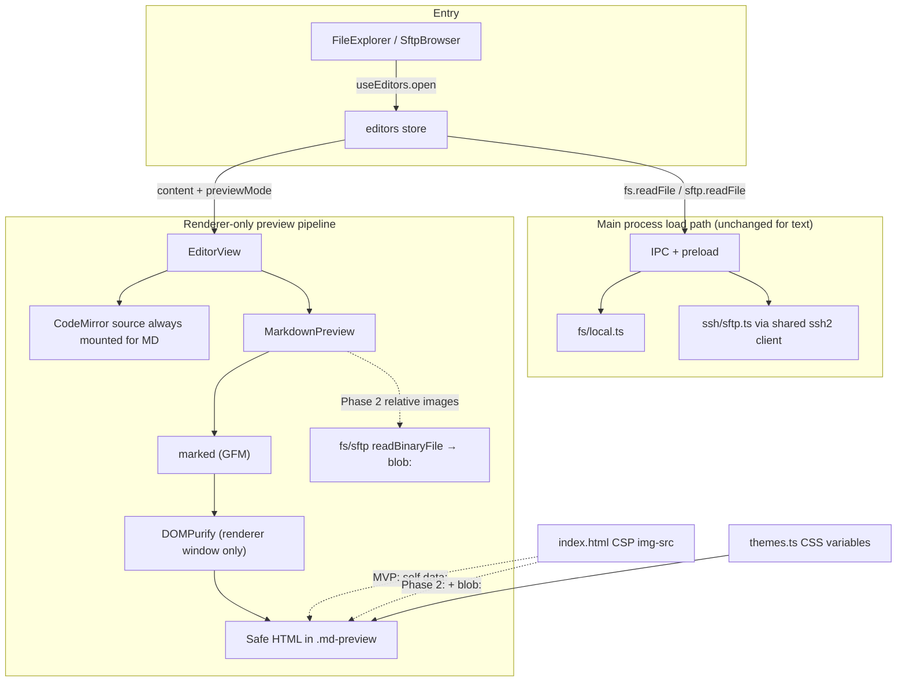
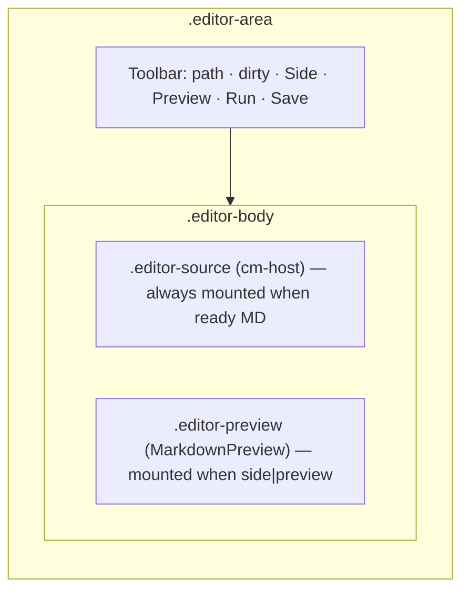

# Design: VS Code–style Markdown Preview for Local and Remote Files

| Field | Value |
| --- | --- |
| **Author** | TBD |
| **Date** | 2026-07-09 |
| **Status** | Ready for implementation |
| **Product** | DevTerm (Electron 29 desktop terminal) |
| **Related surfaces** | In-app CodeMirror editor, FileExplorer / SFTP, theme CSS variables, renderer CSP |

---

## Overview

DevTerm already opens local and remote (SFTP) text files in a CodeMirror 6 editor, including Markdown with syntax highlighting via `@codemirror/lang-markdown`. Users still cannot *preview* rendered Markdown the way VS Code does — side-by-side with the source, live as they type, themed to match the app.

This design adds a **client-side Markdown preview** driven entirely by already-loaded `EditorDoc` content. The same open path (`useEditors.open` → local `fs.readFile` or remote `sftp.readFile`) remains the source of truth. Preview is a renderer-only concern for MVP (parse → sanitize → display). Relative images and other binary assets are a deliberate Phase 2 that introduces small binary-read IPC over existing local FS / shared SSH SFTP channels — never a second SSH connection, never remote shelling out to `pandoc`.

**MVP image policy (CSP-aware):** only `data:image/*` embeds work without widening CSP. Remote `http(s)` images are **not** in MVP. Phase 2 adds relative/local/remote files via `blob:` URLs and a minimal CSP `img-src` update.

---

## Background & Motivation

### Current state

| Capability | Location | Notes |
| --- | --- | --- |
| Open docs store | `src/renderer/store/editors.ts` | `EditorDoc`: scope `local \| remote`, optional `sessionId`, path, content, savedContent, eol, mtimeMs |
| Read/write | `editors.ts` → `window.devterm.fs.*` / `window.devterm.sftp.*` | UTF-8 text; binary rejected via `looksBinary` |
| Size cap | `MAX_EDIT_BYTES` = 5 MiB in `src/shared/types.ts` | Enforced in `src/main/fs/local.ts` and `src/main/ssh/sftp.ts` |
| Editor UI | `src/renderer/components/files/EditorView.tsx` | Toolbar (path, dirty, Run, Save) + CodeMirror; Save hotkey is CM-only (`Mod-s`) today |
| Mount point | `src/renderer/components/chrome/TerminalsView.tsx` | When `editorFocused`, shows `.pane-editor` with `EditorView` |
| Open entry points | `FileExplorer.tsx`, `SftpBrowser.tsx` | Both call `useEditors.open(...)` |
| MD highlighting | `src/renderer/lib/cm-languages.ts` | `md` / `markdown` → `markdown()` only (not `mdown`/`mkd`) |
| Themes | `src/renderer/lib/themes.ts` + CSS vars | `--bg`, `--bg-term`, `--panel`, `--fg`, `--muted`, `--accent`, `--border`, … |
| Debounce helper | `src/renderer/lib/debounce.ts` | `useDebouncedCallback` debounces **function invocation**, not React props |
| External links | `window.devterm.openExternal` | Scheme-safe OS browser open (`http`/`https`/`mailto` only via `openExternalSafe`) |
| Renderer CSP | `src/renderer/index.html` | `img-src 'self' data:` — **blocks** remote `http(s)` images and `blob:` until updated |
| App settings (live) | `src/renderer/store/settings.ts` | **`localStorage` key `devterm.settings.v1`** — not a live `userData/settings.json` |
| Settings export note | `src/main/settings-io.ts` | Explicitly: no canonical live `settings.json` for the renderer store; export falls back to defaults |

> **Doc drift note:** `Agents.md` still mentions `settings.json` for app settings. **Implementers must follow the code** (`localStorage` via `useSettings`). Do not invent a parallel `userData/settings.json` write path for preview defaults.

The editor is a full-area overlay over the terminal workspace (terminals stay mounted under `.term-hidden`). There is no split *within* the editor chrome today: one active doc fills `.editor-area`.

### Pain points

1. README / runbook / notes files on remote hosts require leaving DevTerm or reading raw Markdown.
2. Operators already open `.md` files for edit; preview is the missing half of that loop.
3. Remote content is already in memory as text — re-fetching or remote conversion would be slower and less secure.

### Why not remote rendering?

- Shells out or installs tools on the host (`pandoc`, etc.) — policy and air-gap hostile.
- Latency and auth surface of extra exec channels.
- Content is already available as `EditorDoc.content` after open.

---

## Goals & Non-Goals

### Goals

1. **VS Code–like preview modes** for Markdown docs: edit only, side-by-side edit + preview, preview only.
2. **Live update** while typing, debounced (~150–250 ms), **without resetting preview scroll** on each re-render.
3. **Local and remote parity**: same UI and rendering path; remote uses existing SFTP-backed `EditorDoc`.
4. **Common Markdown + practical GFM**: headings, emphasis, lists (incl. task lists), blockquotes, fenced code, tables, horizontal rules, links, images where CSP allows (`data:` in MVP; relative/blob in Phase 2).
5. **Theme-aware** preview chrome using existing CSS variables (no hardcoded palettes).
6. **XSS-safe** rendering of untrusted Markdown (including remote files and pasted HTML), with automated regression tests on the pure pipeline.
7. **Incremental delivery**: ship a useful MVP without blocking on relative images, scroll sync, KaTeX, Mermaid, or export.
8. **Fit DevTerm architecture**: new main/preload/shared surface only when binary asset reads are required; keep terminals mounted and xterm slots stable; **keep CodeMirror mounted across preview modes in MVP**.

### Non-Goals (MVP)

- WYSIWYG Markdown editing (preview is read-only).
- Separate “preview-only file opener” that bypasses the editor store.
- Remote conversion tools or network fetches for markdown → HTML on the host.
- Full CommonMark edge-case parity with VS Code’s exact engine.
- Wiki-style `[[links]]`, plantUML, Jupyter notebooks, or multi-file doc sites.
- Persisting open preview panes across app restarts (editors themselves are in-memory only).
- In-app browser webview for preview (unnecessary isolation cost for sanitized HTML).
- **Remote `http(s)` Markdown images** (blocked by CSP; optional later with explicit CSP + privacy decision).
- **Draggable editor/preview sash** (fixed ~50/50 side-by-side; resize is P1 polish, not MVP).
- **Bidirectional line-anchored scroll sync** (P3); MVP only preserves preview `scrollTop` across re-renders.
- **`.mdx` preview** (excluded until an MDX-aware pipeline; user-locked for MVP).
- **FileExplorer / SftpBrowser “Open Preview” context menu** (toolbar only in MVP; user-locked).

### Non-Goals (near-term polish still out of scope unless pulled forward)

- Bidirectional scroll sync, outline/TOC panel, export HTML/PDF, KaTeX, Mermaid, print CSS, find-in-preview, remote image allow-list setting.

---

## Proposed Design

### High-level architecture



### Content Security Policy (CSP)

Current meta CSP in `src/renderer/index.html`:

```html
content="default-src 'self'; script-src 'self'; style-src 'self' 'unsafe-inline'; img-src 'self' data:; connect-src 'self'"
```

| Image source | MVP | Phase 2 | Notes |
| --- | --- | --- | --- |
| `data:image/*` | ✅ allowed | ✅ | Works under current CSP |
| Relative / absolute local or SFTP files | ❌ placeholder | ✅ via `blob:` | Requires CSP `img-src` add `blob:` |
| Remote `http:` / `https:` | ❌ blocked | ❌ by default | Would need CSP + network surface expansion; optional later setting |
| `file://` | ❌ never | ❌ never | Sandbox; use IPC binary reads only |

**Decision (safer MVP — locked):**

1. **Do not widen CSP in PR1.** MVP image policy = `data:image/*` only (plus broken placeholders for everything else).
2. **Phase 2 (PR5):** update CSP to `img-src 'self' data: blob:` when relative images ship. Prefer `blob:` object URLs from IPC bytes over stuffing large base64 into HTML.
3. **Remote network images:** remain out of scope until a product decision explicitly allows them (would set `img-src` to include `https:` and optionally `http:`, and re-open SSRF/privacy analysis for loads from the **main renderer**, not the browser partition).

CSP is both a **control** (limits accidental remote loads) and a **constraint** (design must not claim features the meta policy forbids).

### User experience (VS Code–like)

| Mode | Layout | When |
| --- | --- | --- |
| **Edit** | Source visible; preview panel hidden (still may stay mounted if previously shown — see layout) | Default for MD until user opts in |
| **Side-by-side** | Source left (~50%) + preview right, fixed split | Primary “preview while editing” mode |
| **Preview** | Preview visible; **source parked via zero-box CSS but still mounted** (Markdown only) | Reading / review |

#### Canonical toolbar control model (MVP — locked)

When the active doc is Markdown (see detection below), show **two** toolbar toggle buttons **before** Run / Save (after the spacer / error strip):

| Control | Label (short) | Hotkey (PR2) | Behavior |
| --- | --- | --- | --- |
| Side | **Side** | `Ctrl/Cmd+Shift+M` (`markdownPreview`) | Toggle: if mode is `side` → `edit`; else → `side` |
| Preview | **Preview** | `Ctrl/Cmd+Shift+V` (`markdownPreviewOnly`) | Toggle: if mode is `preview` → `edit`; else → `preview` |

**Mutual exclusivity:** at most one of Side / Preview is “on”. Both off = `edit`.

**Active state:**

- `aria-pressed={true}` and CSS class `active` (or `is-pressed`) when that mode is current.
- Tooltips include the shortcut once PR2 lands; until then tooltips are “Side-by-side preview” / “Preview only”.

**Icons:** reuse lucide-style icons already in the app if available (e.g. columns / eye); otherwise text labels **Side** / **Preview** are acceptable for MVP — no inventing a three-state cycle button.

**Do not** implement a single cycling button in MVP.

**Other UX rules:**

1. Modes are **per document id** so switching editor tabs restores that doc’s mode.
2. Closing the doc clears mode state with the doc.
3. Non-Markdown files never show the controls.
4. Toolbar (including Save) remains visible in all three modes so Save is always clickable.

#### Live updates

- Source of truth: `EditorDoc.content` updated by CodeMirror’s `updateListener` (existing path in `EditorView.tsx`).
- `MarkdownPreview` receives `content` + `docId` as props (or selects from the store).
- Re-render is **debounced** (~200 ms) via `useDebouncedCallback` applied correctly (see below).
- Force **immediate** re-render on mode enter, on `docId` switch, and cancel pending debounced work on unmount / doc change.
- **Scroll preservation (MVP):** before writing new HTML into the preview container, capture `scrollTop` / `scrollLeft`; after write, restore them. This is **not** line-anchored sync with the editor (that is P3). Goal: typing mid-file in side-by-side must not jump the preview to the top.

#### Debounce integration (concrete pattern)

`useDebouncedCallback` delays **function calls**, not prop updates. Use **one** effect that chooses immediate vs debounced apply from identity changes:

```tsx
// MarkdownPreview.tsx (illustrative)
const [html, setHtml] = useState('')
const prevIdentity = useRef({ docId, previewMode })

const apply = useCallback((source: string) => {
  try {
    const clean = renderMarkdownToSafeHtml(source) // marked + DOMPurify (sync in MVP)
    // Prefer ref write for scroll restore:
    // const el = containerRef.current
    // const top = el?.scrollTop ?? 0; const left = el?.scrollLeft ?? 0
    // el.innerHTML = clean; el.scrollTop = top; el.scrollLeft = left
    setHtml(clean)
  } catch {
    setHtml('') // + surface error strip via separate state
  }
}, [])

const debouncedApply = useDebouncedCallback((source: string) => apply(source), 200)

useEffect(() => {
  const identityChanged =
    prevIdentity.current.docId !== docId ||
    prevIdentity.current.previewMode !== previewMode
  prevIdentity.current = { docId, previewMode }

  if (identityChanged) {
    debouncedApply.cancel()
    apply(content) // immediate on mount, doc switch, or mode enter
  } else {
    debouncedApply(content) // live typing only
  }
}, [content, docId, previewMode, apply, debouncedApply])

// cancel() also runs on unmount via useDebouncedCallback
```

Do **not** use a generation counter for MVP (render is synchronous). Reintroduce a gen/token only when Phase 2 makes asset resolution async, so stale image callbacks cannot apply to the wrong doc.

#### Empty / error states

- Loading / error docs: no preview body (same status UI as today).
- Empty content: empty preview with muted “Nothing to preview” placeholder.
- Render exceptions: catch, show non-throwing error strip in the preview pane; never crash the editor shell.

### Component layout



**DOM structure (canonical — keep source mounted):**

```tsx
// previewMode for non-MD is always treated as 'edit' (no controls; ignore stored value)
const bodyMode = isMarkdown ? previewMode : 'edit'
const sourceHidden = isMarkdown && previewMode === 'preview' // NEVER hide for !isMarkdown

<div className="editor-area">
  <div className="editor-toolbar">
    {/* scope, path, dirty, errors */}
    <span className="spacer" />
    {isMarkdown && (
      <>
        <button
          type="button"
          className={previewMode === 'side' ? 'active' : undefined}
          aria-pressed={previewMode === 'side'}
          title="Side-by-side preview"
          onClick={() =>
            setPreviewMode(doc.id, previewMode === 'side' ? 'edit' : 'side')
          }
        >
          Side
        </button>
        <button
          type="button"
          className={previewMode === 'preview' ? 'active' : undefined}
          aria-pressed={previewMode === 'preview'}
          title="Preview only"
          onClick={() =>
            setPreviewMode(doc.id, previewMode === 'preview' ? 'edit' : 'preview')
          }
        >
          Preview
        </button>
      </>
    )}
    {/* Run, Save */}
  </div>
  {ready && (
    <div className={`editor-body mode-${bodyMode}`}>
      {/* Always mount source for every ready doc. Zero-box hide ONLY in MD preview-only. */}
      <div
        className={
          sourceHidden ? 'editor-source editor-source--parked' : 'editor-source'
        }
        aria-hidden={sourceHidden || undefined}
      >
        <CodeMirror key={doc.id} doc={doc} />
      </div>
      {isMarkdown && (previewMode === 'side' || previewMode === 'preview') && (
        <div className="editor-preview">
          <MarkdownPreview
            docId={doc.id}
            content={doc.content}
            previewMode={previewMode}
            scope={doc.scope}
            path={doc.path}
            sessionId={doc.sessionId}
          />
        </div>
      )}
    </div>
  )}
</div>
```

**Do not use the HTML `hidden` attribute or `display: none` on `.editor-source`.** That combination is easy to get wrong for non-MD files and forces a harder CodeMirror remount/relayout path.

**Mounting rules (PR1 acceptance criteria — locked):**

1. For **every** ready doc (Markdown and non-Markdown), CodeMirror mounts in `.editor-source` and remains visible unless rule 2 applies.
2. For Markdown docs only, when `previewMode === 'preview'`, **park** the source with the zero-box CSS class `editor-source--parked` (still in the DOM). Condition is exactly:  
   `sourceHidden = isMarkdown && previewMode === 'preview'`  
   **Never** hide because `!isMarkdown`.
3. Do **not** conditionally unmount `<CodeMirror>` when entering preview-only (that destroys undo, selection, and `viewRegistry` entries used by Run).
4. After leaving preview-only → `edit` or `side`, call `view.requestMeasure()` on the registered CM view (from `viewRegistry`) after layout (e.g. `requestAnimationFrame` or `useLayoutEffect`) so the viewport is not empty/stale.
5. `MarkdownPreview` mounts only when `isMarkdown && (side || preview)`; on re-enter, scroll starts at top unless we later persist scroll per doc (optional polish).
6. Non-Markdown docs: no Side/Preview buttons, `bodyMode = 'edit'`, single-column source, no preview pane. **Acceptance check:** opening `.ts` / `.json` / etc. still shows and edits normally.

**Side-by-side sizing:** fixed `1fr 1fr` grid. **No drag sash in MVP** (non-goal). Optional P1: thin drag handle reusing split-handle interaction patterns from the terminal layout.

### Markdown detection

```ts
function isMarkdownName(name: string): boolean {
  const ext = name.split('.').pop()?.toLowerCase() ?? ''
  // .mdx intentionally excluded in MVP (user decision)
  return ext === 'md' || ext === 'markdown' || ext === 'mdown' || ext === 'mkd'
}
```

Align with `cm-languages.ts` which maps `md` and `markdown` today; optionally add `mdown` / `mkd` for highlight consistency in a small follow-up (preview can still detect them). **Do not** enable preview for `.mdx` in MVP.

### Rendering pipeline

**Pinned library choice (MVP):**

| Package | Version intent | Role |
| --- | --- | --- |
| `marked` | `^15` (current major with built-in GFM support) | MD → HTML |
| `dompurify` | `^3` | Sanitize HTML in the **renderer** (`window` required) |

- Prefer packages that ship their own TypeScript types; add `@types/*` only if the chosen version does not.
- Do **not** run DOMPurify in the main process without a JSDOM (or similar) window — sanitize is renderer-only.
- Optional later: `highlight.js` / `shiki` for code fences (PR6).

**`marked` configuration (locked for PR1):**

```ts
import { marked } from 'marked'
import DOMPurify from 'dompurify'

marked.setOptions({
  gfm: true,       // tables, strikethrough, task lists, autolinks
  breaks: false,   // CommonMark-like hard breaks off
  pedantic: false
})

// Prefer disabling raw HTML passthrough if the marked API allows for this major;
// otherwise rely on DOMPurify to strip dangerous tags (defense in depth).
```

**Fixture expectations (Markdown → tags after sanitize):**

| Markdown input | Expected allowed output (shape) |
| --- | --- |
| `# Title` | `<h1>…</h1>` |
| `**bold**` / `*em*` | `<strong>` / `<em>` |
| `- [ ] task` / `- [x] done` | list + `input type="checkbox" disabled` (checked when done) |
| `~~strike~~` | `<del>` |
| fenced ` ```js ` | `<pre><code>…` (class may include language) |
| GFM table | `<table><thead>…`<tbody>…` |
| `[a](https://example.com)` | `<a href="https://example.com">` |
| `[x](javascript:alert(1))` | href stripped or neutralized; no JS navigation |
| `<script>alert(1)</script>` | removed entirely |
| `` | no `onerror`; unsafe src stripped |
| `` | allowed if valid `data:image/*` |
| `` | **MVP:** `src` stripped or left inert / broken (CSP + policy); not loaded |
| `` | **MVP:** placeholder / unresolved; Phase 2 → `blob:` |

**Sanitize policy (strict):**

**ALLOWED_TAGS (MVP):**  
`h1`, `h2`, `h3`, `h4`, `h5`, `h6`, `p`, `ul`, `ol`, `li`, `blockquote`, `pre`, `code`, `table`, `thead`, `tbody`, `tr`, `th`, `td`, `a`, `img`, `em`, `strong`, `del`, `hr`, `br`, `input`, `span` (only if marked emits it; prefer stripping unused).

**ALLOWED_ATTR (MVP — explicit, locked):**

| Attr | Used on | Why |
| --- | --- | --- |
| `href` | `a` | External + hash links |
| `src` | `img` | `data:image/*` only in MVP |
| `alt` | `img` | Accessibility |
| `title` | `a`, `img` | Tooltips |
| `class` | `code`, `pre`, `*` as emitted | Fenced language class (e.g. `language-js`) |
| `id` | headings (`h1`–`h6`) | In-doc `#hash` TOC targets |
| `type` | `input` | Must be `checkbox` only |
| `checked` | `input` | Task-list done state |
| `disabled` | `input` | Task lists are non-interactive |
| `align` | `th`, `td` | Optional GFM table alignment if emitted |
| `colspan`, `rowspan` | `th`, `td` | Rare tables; harmless if allowlisted |

**Also set:**

- `ALLOW_DATA_ATTR: false` — no `data-*` passthrough.
- `ALLOW_UNKNOWN_PROTOCOLS: false`.
- `ALLOWED_URI_REGEXP` (or equivalent hooks): `href` → `http:`, `https:`, `mailto:`, or same-doc `#…`; `src` → `data:image/…` only in MVP (Phase 2 also `blob:` from our resolver).

**Tag/attr hardening:**

- Strip all `script`, `style`, `iframe`, `object`, `embed`, `form`, and any `on*` handlers (DOMPurify default + no event attrs in ALLOWED_ATTR).
- **`input`:** allow only as task-list checkboxes. Use a DOMPurify `uponSanitizeElement` / `afterSanitizeAttributes` hook to: (1) drop any `input` whose `type` is not `checkbox`; (2) force `disabled` (and remove `name`/`value` if present). Fixtures require `type="checkbox"`, `disabled`, and `checked` when done.
- `img[src]` **MVP:** `data:image/*` only. Neutralize `http:`, `https:`, relative, `file:`, `blob:` until Phase 2.
- **Phase 2 `img[src]`:** additionally allow `blob:` URLs **we** create (never attacker-controlled blob strings from Markdown source).

**Link click handling (capture on `.md-preview`):**

| `href` | Action |
| --- | --- |
| `http:` / `https:` / `mailto:` | `preventDefault`; `window.devterm.openExternal(url)` |
| `#fragment` / `#` | `preventDefault`; scroll within `.md-preview` only (`getElementById` / `querySelector` on ids/names **inside the preview root**). Never change `window.location` / BrowserWindow navigation. |
| relative paths, `file:`, `javascript:`, other | `preventDefault`; no-op (or strip at sanitize time) |

Heading anchors: if `marked` does not emit `id`s on headings by default, add a small post-process or marked extension in PR1 to slugify heading text into `id` attributes so TOC-style `[Foo](#foo)` works. Keep slugify pure and deterministic. Unit tests must assert heading `id` survives sanitize.

**Do not use `dangerouslySetInnerHTML` without sanitization.** Pattern:

```ts
const ALLOWED_TAGS = [
  'h1', 'h2', 'h3', 'h4', 'h5', 'h6', 'p', 'ul', 'ol', 'li', 'blockquote',
  'pre', 'code', 'table', 'thead', 'tbody', 'tr', 'th', 'td',
  'a', 'img', 'em', 'strong', 'del', 'hr', 'br', 'input', 'span'
] as const

const ALLOWED_ATTR = [
  'href', 'src', 'alt', 'title', 'class', 'id',
  'type', 'checked', 'disabled',
  'align', 'colspan', 'rowspan'
] as const

export function renderMarkdownToSafeHtml(source: string): string {
  const dirty = marked.parse(source, { async: false }) as string
  return DOMPurify.sanitize(dirty, {
    ALLOWED_TAGS: [...ALLOWED_TAGS],
    ALLOWED_ATTR: [...ALLOWED_ATTR],
    ALLOW_DATA_ATTR: false,
    // ALLOWED_URI_REGEXP or hooks: http(s)/mailto/# for href; data:image for src
  })
  // + hooks to force input[type=checkbox][disabled] only
}
```

### State model

Extend the editors store (preferred) rather than a parallel store — preview mode is per-doc metadata, same lifecycle as open/close.

```ts
// src/renderer/store/editors.ts (additions)

export type MarkdownPreviewMode = 'edit' | 'side' | 'preview'

export interface EditorDoc {
  // …existing fields…
  /** Only meaningful for Markdown files; default 'edit'. */
  previewMode?: MarkdownPreviewMode
}

// actions
setPreviewMode: (id: string, mode: MarkdownPreviewMode) => void
// Optional helper — not required if toolbar implements the two toggles directly:
// toggleSidePreview / togglePreviewOnly
```

**Persistence (PR3, optional):** remember default mode for *newly opened* MD docs via **`useSettings` → `localStorage` (`devterm.settings.v1`)**, not `userData/settings.json`.

```ts
// AppSettings in settings.ts
markdownPreviewDefault: 'edit' | 'side' | 'preview' // DEFAULTS: 'edit'
```

**User-locked:** every newly opened MD doc defaults to `'edit'`. Once PR3 lands, seed from `markdownPreviewDefault` only if the user changed it; factory default remains `'edit'`. In-memory `previewMode` on the open doc is never written to disk.

### Theme-aware preview CSS

Add styles under `src/renderer/styles/panels.css` (alongside existing editor rules) using variables from `applyTheme()`:

```css
.editor-body {
  flex: 1;
  min-height: 0;
  display: grid;
}
.editor-body.mode-edit {
  grid-template-columns: 1fr;
}
/* Preview pane is not mounted in edit mode — no need to hide it */
.editor-body.mode-side {
  grid-template-columns: minmax(0, 1fr) minmax(0, 1fr);
}
.editor-body.mode-preview {
  grid-template-columns: 1fr;
}
/*
 * Locked hide strategy (MVP): zero-box park — NOT HTML [hidden] / display:none.
 * Applied only when class editor-source--parked is set
 * (isMarkdown && previewMode === 'preview').
 */
.editor-source.editor-source--parked {
  position: absolute;
  width: 0;
  height: 0;
  overflow: hidden;
  visibility: hidden;
  pointer-events: none;
  opacity: 0;
}
.editor-source,
.editor-preview {
  min-width: 0;
  min-height: 0;
  overflow: auto;
}
.editor-body.mode-side .editor-source:not(.editor-source--parked) {
  border-right: 1px solid var(--border);
}

/* Toolbar toggles */
.editor-toolbar button.active,
.editor-toolbar button[aria-pressed='true'] {
  /* use existing accent/button patterns */
  outline: 1px solid var(--accent);
}

.md-preview {
  padding: 16px 20px;
  color: var(--fg);
  background: var(--bg-term);
  font-family: system-ui, Segoe UI, sans-serif;
  line-height: 1.55;
  font-size: 14px;
}
.md-preview h1, .md-preview h2, .md-preview h3 {
  border-bottom: 1px solid var(--border);
  padding-bottom: 0.25em;
}
.md-preview a { color: var(--accent); }
.md-preview code {
  background: color-mix(in srgb, var(--panel-2) 80%, transparent);
  border-radius: 4px;
  padding: 0.1em 0.35em;
  font-family: ui-monospace, 'Cascadia Code', Consolas, monospace;
}
.md-preview pre {
  background: var(--panel);
  border: 1px solid var(--border);
  border-radius: 6px;
  padding: 12px;
  overflow: auto;
}
.md-preview pre code { background: transparent; padding: 0; }
.md-preview blockquote {
  border-left: 3px solid var(--accent);
  margin-left: 0;
  padding-left: 12px;
  color: var(--muted);
}
.md-preview table { border-collapse: collapse; width: 100%; }
.md-preview th, .md-preview td {
  border: 1px solid var(--border);
  padding: 6px 10px;
}
.md-preview img { max-width: 100%; height: auto; }
```

Glass themes continue to work via existing CSS variable cascade; no special `data-glass` handling required beyond inherited surfaces.

### Relative images (Phase 2 — design now, implement later)

**Problem:** `` must resolve relative to the Markdown file’s directory. Local paths need binary FS read; remote paths need binary SFTP read on the **existing** session client. Current `readFile` APIs reject binaries (`looksBinary`) and return UTF-8 text only.

**Approach:**

1. Add binary-capable read APIs (shared contract):

```ts
// shared/types.ts
export const MAX_PREVIEW_ASSET_BYTES = 8 * 1024 * 1024 // align with dialog image cap

export interface BinaryFileContent {
  path: string
  /** Base64 payload (IPC-friendly). */
  base64: string
  mime: string
  size: number
}

// DevtermAPI + IPC const object together
fs.readBinaryFile(path: string, maxBytes?: number): Promise<BinaryFileContent>
sftp.readBinaryFile(sessionId: string, path: string, maxBytes?: number): Promise<BinaryFileContent>
```

2. Main implementations:
   - Local: `fs.readFile` buffer, MIME from extension (reuse map from `src/main/ipc/dialog.ts`), reject oversize / non-image for preview use.
   - Remote: `sftp.readFile` on existing SFTP wrapper from `ssh.getSftp(sid)` — **same client as shell**.

3. Renderer asset resolver in `MarkdownPreview`:
   - Custom image handling that rewrites relative `src` to a stable key, then async-loads assets into a `Map<path, blobUrl>`.
   - Create `URL.createObjectURL(blob)` from decoded base64; set `img.src` to the blob URL (**not** giant data URLs in HTML).
   - Revoke object URLs on doc close / path change / unmount.
   - Concurrent fetch limit (e.g. 4) and per-doc cache.
   - **CSP:** PR5 updates `img-src` to `'self' data: blob:`.

4. Path join rules:
   - Remote: POSIX join relative to dirname of `doc.path`.
   - Local: small path helper in renderer (no Node `path`); normalize carefully.
   - Absolute paths on remote (`/var/...`) and Windows local (`C:\...`) resolve when written in the Markdown.

5. **Path security policy (Phase 2 — locked: trusted-operator model):**

   DevTerm is a desktop operator tool whose FS/SFTP APIs already allow reading any path the process / session can access (file editor, explorer, transfers). Preview image resolution **uses the same capability surface**: any path the existing APIs can read may be loaded as an image (subject to size + MIME allowlist).

   - Document this as intentional: a malicious remote README could reference sensitive remote paths as images **only if** the operator already has an authenticated session with that access — same as opening those paths in the editor.
   - Still: normalize paths; MIME allowlist; size cap; no `file://` in the renderer; raster-only for Phase 2 MVP of images (block SVG or sanitize separately).
   - **Not** implementing a chroot-under-`dirname(doc.path)` default unless product later requests a “strict relative images” setting.

6. Security (images):
   - Only raster image MIME types in Phase 2 first ship (`image/png`, `jpeg`, `gif`, `webp`, `bmp`). **SVG blocked** until a dedicated SVG sanitize path exists.
   - Never load `file://` directly in the sandboxed renderer.

**MVP without this:** broken-image / muted placeholder for relative and `http(s)` sources; `data:image/*` works under current CSP.

### Sequence: open Markdown and toggle side-by-side

```mermaid
sequenceDiagram
  participant User
  participant Explorer as FileExplorer
  participant Store as useEditors
  participant Main as Main FS/SFTP
  participant View as EditorView
  participant Prev as MarkdownPreview

  User->>Explorer: Open README.md
  Explorer->>Store: open({ scope, sessionId?, path })
  Store->>Main: readFile (existing IPC)
  Main-->>Store: FileContent UTF-8
  Store-->>View: doc ready, content, previewMode=edit
  User->>View: Click Side (aria-pressed)
  View->>Store: setPreviewMode(id, 'side')
  Store-->>View: grid mode-side; CM still mounted
  View->>Prev: mount + immediate render
  Prev->>Prev: marked.parse → DOMPurify.sanitize
  Prev-->>User: Themed HTML preview
  User->>View: Type in CodeMirror
  View->>Store: setContent
  Store-->>Prev: content change (200ms debounce)
  Prev->>Prev: preserve scrollTop; replace HTML
  Prev-->>User: Updated preview (scroll stable)
```

### Hotkeys

#### Save (PR1 — locked)

Today Save is only on the CodeMirror keymap (`Mod-s` in `EditorView.tsx`). `HOTKEYS` / `matchHotkey` has no save id. Preview focus makes toolbar Save insufficient for keyboard users.

**Preferred wiring (a) — add to the hotkey registry:**

| Id | Default | Label | When |
| --- | --- | --- | --- |
| `saveEditor` | `mod+s` | Save file | PR1 |

**App.tsx pattern** (mirror the existing `nextTab` / `prevTab` focused guard, which returns **before** `preventDefault`):

```ts
const id = matchHotkey(e, resolveHotkeys(keybindings))
if (!id) return

// Focus-gated chords: do NOT preventDefault when inactive
if (id === 'saveEditor') {
  const ed = useEditors.getState()
  const doc = ed.docs.find((d) => d.id === ed.activeId)
  if (!ed.focused || !doc || doc.state !== 'ready') return // let event propagate
  e.preventDefault()
  void ed.save(doc.id)
  return
}

// …existing: nextTab/prevTab early-return, then generic preventDefault + switch
```

- List `src/renderer/lib/hotkeys.ts` in **PR1** (add `saveEditor` to `HotkeyId` + `HOTKEYS`).
- CM’s existing `Mod-s` remains as belt-and-suspenders when CM has focus (idempotent if already saved / not dirty).
- Appears in the shortcuts sheet and supports custom keybindings via `settings.keybindings` like other ids.
- Ensures Save works in side-by-side and preview-only when focus is in the preview pane.

**Do not** special-case raw `ctrl/meta+s` outside `matchHotkey` — that skips the shortcuts sheet and custom bindings.

#### Markdown preview toggles (PR2)

| Id | Default | Label |
| --- | --- | --- |
| `markdownPreview` | `mod+shift+m` | Toggle Markdown side-by-side preview |
| `markdownPreviewOnly` | `mod+shift+v` | Toggle Markdown preview only |

**Collision check:** neither preview chord exists in the current `HOTKEYS` list (verified free). `mod+s` is new as `saveEditor` only.

**App.tsx wiring for preview ids (PR2):**

- On match, if `useEditors.getState().focused` **and** active doc is Markdown `ready`: apply the same toggle semantics as the toolbar buttons; then `preventDefault`.
- If editor is not focused / not Markdown: **return before `preventDefault`** (same focused-guard style as `saveEditor` / `nextTab`), so the chord is not swallowed app-wide when unused.
- Do **not** steal keys when focus is in a terminal beyond existing focus guards.

### Performance targets

| Scenario | Target |
| --- | --- |
| Toggle preview mode | < 50 ms UI response |
| Live re-render after debounce (≤ 200 KB MD) | < 50 ms parse+sanitize on typical laptop |
| Live re-render (up to `MAX_EDIT_BYTES` ~5 MB) | Acceptable but debounced; may take 100–300 ms |
| Preview scroll across re-render | `scrollTop` restored; no jump-to-top while typing |
| Memory | One sanitized HTML string per active preview; Phase 2 blob cache capped |

Avoid re-parsing when content unchanged (compare string). Only the active doc’s preview runs the pipeline.

### Integration with existing open path

No new open dialog for MVP:

- Double-click / edit in FileExplorer and SftpBrowser already open `EditorDoc`.
- **Activation surface (MVP — locked):** toolbar Side / Preview toggles only. **No** FileExplorer (or SftpBrowser) context-menu “Open Preview” in MVP. Preview hotkeys ship in PR2, not as an explorer entry point.

### Files expected to change (implementation map)

| Area | Files |
| --- | --- |
| State | `src/renderer/store/editors.ts` |
| UI | `src/renderer/components/files/EditorView.tsx`, new `MarkdownPreview.tsx` |
| Render lib | new `src/renderer/lib/markdown-preview.ts` (parse + sanitize + link/hash policy) |
| Styles | `src/renderer/styles/panels.css` |
| CSP (Phase 2) | `src/renderer/index.html` (`img-src` + `blob:`) — **not** changed in PR1 |
| Hotkeys / Save (PR1) | `src/renderer/lib/hotkeys.ts` (`saveEditor`), `src/renderer/App.tsx` (focused guard) |
| Preview hotkeys (PR2) | same files (`markdownPreview*`) |
| Settings (PR3) | `src/renderer/store/settings.ts` (`localStorage`), `SettingsModal.tsx` |
| Tests (PR1) | new pure tests for `markdown-preview.ts` (see Testing) |
| Deps | `package.json` — `marked@^15`, `dompurify@^3` (+ types only if needed) |
| Phase 2 IPC | `src/shared/types.ts`, `src/preload/index.ts`, `src/main/ipc/files.ts`, `src/main/fs/local.ts`, `src/main/ssh/sftp.ts` |

---

## API / Interface Changes

### MVP (no main process API change)

Renderer-only. Existing:

```ts
window.devterm.fs.readFile(path): Promise<FileContent>
window.devterm.sftp.readFile(sessionId, path): Promise<FileContent>
window.devterm.openExternal(url): Promise<void>
```

### Phase 2 binary assets (new)

**Shared (`src/shared/types.ts`):**

```ts
export const MAX_PREVIEW_ASSET_BYTES = 8 * 1024 * 1024

export interface BinaryFileContent {
  path: string
  base64: string
  mime: string
  size: number
}

// IPC channel names on the IPC const object + DevtermAPI surface together
fsReadBinaryFile: 'fs:readBinaryFile'
sftpReadBinaryFile: 'sftp:readBinaryFile'
```

**Preload:** expose `fs.readBinaryFile` / `sftp.readBinaryFile` mirroring text APIs.

**Main:**

- `readBinaryFileLocal(path, maxBytes = MAX_PREVIEW_ASSET_BYTES)`
- `readBinaryFileRemote(sftp, path, maxBytes = …)` using existing SFTP from `ssh.getSftp(sid)`

**Rejection rules:** oversize, is-directory, unsupported MIME (when used for preview images).

### Settings (PR3 optional polish)

```ts
// AppSettings in src/renderer/store/settings.ts
markdownPreviewDefault: 'edit' | 'side' | 'preview' // DEFAULTS.markdownPreviewDefault = 'edit'
```

**Persistence path (locked):**

1. Extend `AppSettings` + `DEFAULTS` + load/validate in `load()` + `persist()` / setters in `settings.ts`.
2. Storage: **`localStorage['devterm.settings.v1']`** only.
3. Settings UI: `SettingsModal.tsx` (or existing settings sections).
4. On `useEditors.open` for Markdown files, seed `previewMode` from `useSettings.getState().markdownPreviewDefault`.

**Do not** write a parallel live `userData/settings.json` for this field. Main `settings-io.ts` remains export-oriented and may stay unaware until a broader settings migration (out of scope).

---

## Data Model Changes

### In-memory only (MVP)

```ts
interface EditorDoc {
  // existing…
  previewMode?: 'edit' | 'side' | 'preview'
}
```

No migration; undefined ⇒ `'edit'`.

### On-disk (optional PR3)

- **`localStorage` `devterm.settings.v1`:** `markdownPreviewDefault` only among new fields.
- No change to connections, workspaces, snippets JSON files in `userData`.

### Workspace capture

Workspaces do not snapshot open editors today; no workspace schema change.

---

## Alternatives Considered

### A. Client-side sanitize + render in React (Chosen)

**Pros:** Fast; works offline; same path local/remote; no host tools; fits sandboxed renderer; matches VS Code mental model.  
**Cons:** Must get XSS right; relative images need extra IPC + CSP `blob:`; engine differences vs VS Code.

### B. Embed Electron `<webview>` / iframe with `srcdoc`

**Pros:** Stronger process isolation for hostile HTML.  
**Cons:** Heavy for editor chrome; theming and font bridging awkward; click/openExternal harder; webview already used for browser panes with different lifecycle. Overkill if DOMPurify is applied correctly.

### C. Remote `pandoc` / `glow` / `mdcat` via SSH exec

**Pros:** Host-true rendering for some ops environments.  
**Cons:** Requires binaries on host; high latency; pollutes remote; breaks air-gap agent philosophy; policy complexity; not live-as-you-type friendly.

### D. Separate “Markdown Preview” session kind (like browser panes)

**Pros:** Could tile preview as a first-class pane in the split tree.  
**Cons:** Large layout/session work; duplicates editor content; risk of reparenting complexity; overscoped for the request. Future enhancement could “pop preview to pane” if demanded.

### E. CodeMirror Markdown preview extensions / live preview plugins

**Pros:** Single scroll surface experiments.  
**Cons:** Weaker GFM table/task UX; harder security boundary; less VS Code–like side-by-side.

**Decision:** A for MVP and primary design; B only if a future threat model requires out-of-process HTML; D deferred.

---

## Security & Privacy Considerations

| Threat | Severity | Mitigation |
| --- | --- | --- |
| XSS via Markdown/HTML in remote files | **High** | DOMPurify strict allowlist in **renderer**; no `javascript:` URLs; no inline event handlers; **automated pure-pipeline tests** in PR1 |
| Sanitize in wrong process | **Medium** | DOMPurify requires a DOM/`window`; run only in renderer — not main without JSDOM |
| SVG / foreignObject script | **High** | Block SVG in Phase 2 first ship |
| Preview navigates BrowserWindow | **High** | `preventDefault` on all `<a>` clicks; `openExternal` for http(s)/mailto; hash links scroll **inside** `.md-preview` only |
| Renderer CSP bypass / feature mismatch | **High** | Treat CSP as source of truth; MVP images = `data:` only; Phase 2 explicitly adds `blob:` to `img-src` in `index.html` |
| Remote `http(s)` image loads from main window | **Medium** | **Default deny** (CSP + sanitize). Allowing later expands main-renderer network surface (distinct from `persist:browser` partition) — requires product sign-off |
| `file://` or path exfiltration via images | **Medium** | No direct file URLs; binary reads only via IPC with size caps |
| Path traversal / arbitrary path as image (Phase 2) | **Medium** | **Trusted-operator model** (locked): same FS/SFTP power as editor; size+MIME limits; document risk |
| Huge Markdown DoS (parse hang) | **Medium** | Debounce; 5 MiB text cap; optional soft warn > 1 MiB |
| Leaking remote file contents via preview cache | **Low** | In-memory only; revoke blobs on close; `closeForSession` drops remote docs |
| Binary IPC abuse | **Medium** | Max bytes; image MIME allowlist; session-scoped SFTP only |
| Large base64 in HTML | **Low** | Phase 2 prefers `blob:` URLs + revoke lifecycle |

**Privacy:** Preview does not upload content. Rendering is local. No analytics. Network image loads (if ever enabled) would use the main BrowserWindow renderer network stack.

**Trust model:** Treat all Markdown as untrusted for XSS. Treat filesystem/SFTP access for assets as **operator-authorized** (same as editing files).

---

## Observability

DevTerm has no centralized metrics backend; follow existing lightweight patterns.

| Signal | Approach |
| --- | --- |
| Render failures | `console.warn` in dev; user-visible preview error strip |
| Asset load failures (Phase 2) | Broken-image placeholder + title tooltip with error |
| Performance | Optional `performance.now()` around parse in dev builds only |
| IPC errors | Existing promise rejection → UI error state |
| XSS regressions | Automated unit tests on `renderMarkdownToSafeHtml` (CI / `npm test` or `node --test`) |

No new main-process logging required for MVP. Phase 2 binary reads can log oversize rejections at `warn` in main if useful for support.

---

## Rollout Plan

### Phases

| Phase | Scope | Ship criteria |
| --- | --- | --- |
| **P0 — MVP** | Detect MD; two toolbar toggles; **CM always mounted** (zero-box park only for MD preview-only); **`requestMeasure` on unhide**; debounced live preview **with scroll preserve**; GFM fixtures; explicit ALLOWED_ATTR; hash + external links; **`saveEditor` in HOTKEYS** + focused guard; pure XSS unit tests; **no CSP change**; `data:` images only; **non-MD editor still works** | `typecheck` + `lint` + pipeline unit tests; manual local + remote README + non-MD open |
| **P1 — UX polish** | Hotkeys; optional settings default (localStorage); code fence styling; optional sash resize | Shortcuts sheet; settings round-trip |
| **P2 — Relative images** | Binary read IPC; resolver + blob cache; CSP `blob:`; raster images local/remote | `./x.png` resolves both scopes; SVG still blocked |
| **P3 — Advanced** | Scroll sync, outline, KaTeX, Mermaid, export HTML, optional remote images | Individual opt-in |

### Feature flag

Not required for desktop single-user app. If desired, gate with settings in `localStorage` via `useSettings`:

```ts
markdownPreviewEnabled: boolean // default true
```

### Rollback

- Revert renderer components + deps; no data migrations.
- Phase 2 IPC: leave unused handlers harmless, or remove with types/preload together.
- Phase 2 CSP: revert `img-src` with the feature.

### Testing strategy

1. **Automated (PR1, required):** pure tests for `src/renderer/lib/markdown-preview.ts`:
   - Strips `<script>`, `onerror`, `javascript:` links, `data:text/html`, disallowed tags.
   - Allows GFM table / task list (`input type=checkbox disabled` ± `checked`) / strikethrough / fenced `class` / heading `id`.
   - Allows `data:image/png` (or representative) `img src`; rejects/neutralizes `https://` and relative `src` in MVP.
   - Runner: prefer existing project test setup if present; otherwise add a minimal `node --test` (or vitest) script in `package.json` so CI/local can run without Electron. Keep tests DOM-dependent only as needed (jsdom or happy-dom if DOMPurify requires it).
2. **Manual:** Open local `README.md`, type mid-file in side-by-side — **preview scroll stays put**; toggle Side/Preview; undo still works after preview-only; after leaving preview-only, CM viewport is correct (`requestMeasure`).
3. **Manual remote:** Open remote `.md` over SSH; one SSH client; preview works.
4. **Manual security / links:** malicious samples do not execute; https link opens OS browser; `#section` scrolls inside preview.
5. **Manual Save:** focus preview pane, Ctrl/Cmd+S saves dirty doc via `saveEditor`; when editor not focused, chord is not forced (focused guard).
6. **Regression (required):** Open a **non-Markdown** file (`.ts`, `.json`, etc.) — source is **visible and editable** (no accidental hide). Run still works after MD mode toggles; terminals stay mounted under editor focus.
7. **Typecheck / lint:** `npm run typecheck`, `npm run lint`.

---

## Resolved Decisions (user)

Product choices locked 2026-07-09 (final — do not re-litigate in implementation):

| # | Topic | Decision |
| --- | --- | --- |
| 1 | **Default mode for Markdown** | Stay on **`edit`** for newly opened MD docs (safer, less surprise). PR3 may still add a user-configurable `markdownPreviewDefault`; ship default remains `edit`. |
| 2 | **`.mdx` support** | **Exclude in MVP.** Do not treat `.mdx` as Markdown for preview detection or toolbar. |
| 3 | **Activation surface** | **Toolbar only in MVP** (Side / Preview toggles). No FileExplorer / SftpBrowser context-menu “Open Preview”. Preview hotkeys remain **PR2**. |

---

## Open Questions

Deferred polish / later product decisions (not blocking PR1):

1. **Whether to ever allow remote http(s) images** (CSP + main-window network surface) — default deny until decided.
2. **Scroll sync priority vs KaTeX/Mermaid** for P3 ordering.
3. **Code fence highlighting library** weight budget (shiki vs highlight.js vs none) for PR6.

---

## Key Decisions

| Decision | Choice | Rationale |
| --- | --- | --- |
| Where content comes from | Existing `EditorDoc.content` | No duplicate loaders; local/remote parity for free |
| Where rendering runs | Sandboxed renderer only | Latency, air-gap, no host dependencies |
| MD engine | `marked@^15` with `gfm: true` | Small, built-in GFM (tables, tasks, strikethrough) |
| XSS strategy | `dompurify@^3` after parse + unit tests | Proven; pure pipeline is testable |
| Sanitize process | Renderer only (needs `window`) | Do not sanitize in main without JSDOM |
| **CSP / image policy** | **MVP: no CSP change; `data:image/*` only. Phase 2: add `blob:`. No http(s) images by default** | Matches real `img-src 'self' data:`; avoids silent broken “features” |
| UI chrome | Modes inside `EditorView`, not new session kind | Minimal layout risk; preserves terminal mount rules |
| **Toolbar control model** | **Two toggles: Side + Preview; mutual exclusive; both off = edit** | Unambiguous for implementers; VS Code–like |
| **Default preview mode** | **`edit` for new MD docs** (user-locked) | Safer, less surprise; PR3 optional preference later |
| **`.mdx` in MVP** | **Excluded** (user-locked) | Not GFM-safe as plain MD; avoid false preview |
| **MVP activation** | **Toolbar only** (user-locked); hotkeys in PR2; no explorer context menu | Keeps PR1 surface small |
| Mode state | Per-doc on `EditorDoc` | Correct tab switch behavior; dies with doc |
| Live update | **Single effect:** identity change → cancel + immediate; else debounced; scrollTop preserve | Avoids double-fire; matches `useDebouncedCallback` semantics |
| DOMPurify attrs | **Explicit ALLOWED_ATTR** incl. `id`, `class`, `type`, `checked`, `disabled`; `ALLOW_DATA_ATTR: false` | Fixtures + task lists + TOC ids survive sanitize |
| Links | Intercept + `openExternal`; **in-doc `#hash` scrolls inside preview** | Matches external policy; TOC links work |
| Relative images | Phase 2 binary IPC + `blob:` | Unblocks MVP |
| **Phase 2 path policy** | **Trusted-operator: any path FS/SFTP can read** | Same power as editor; avoid false sense of chroot |
| SSH for remote assets | Shared session SFTP only | Never open a second SSH client |
| **CodeMirror when preview-only** | **Always mounted; zero-box `.editor-source--parked` only when `isMarkdown && previewMode === 'preview'`; `requestMeasure` on unhide** | No non-MD regression; no `hidden`/`display:none`; remount-safe unhide |
| **Settings storage** | **`localStorage` via `settings.ts` (`devterm.settings.v1`)** | Code is source of truth; Agents.md `settings.json` line is stale |
| **Save hotkey** | **`saveEditor` (`mod+s`) in `HOTKEYS`; App handles only when editor focused + ready; early-return before preventDefault otherwise** | Shortcuts sheet + custom bindings; works with preview focus |
| Themes | CSS variables only | Consistent with `applyTheme` |
| IPC for MVP | None new | Smaller review surface |
| Side split resize | Non-goal for MVP (fixed 50/50) | Scope control; optional P1 sash |

---

## Risks

| Risk | Severity | Mitigation |
| --- | --- | --- |
| XSS miss in sanitizer config | High | Conservative allowlist; **unit tests**; no event attrs |
| CSP feature mismatch | High | Design locked to current CSP for MVP; explicit Phase 2 CSP edit |
| Large file UI jank | Medium | Debounce; optional disable live preview above N KB |
| CM remount loses undo | High if done wrong | **Forbidden in PR1** — park with zero-box CSS, don’t unmount |
| Non-MD editor hidden | High if sample mis-copied | Hide only when `isMarkdown && previewMode === 'preview'` |
| CM blank after unhide | Medium | `view.requestMeasure()` after leaving preview-only |
| Preview scroll jump | Medium | Preserve scrollTop/Left on HTML replace |
| Bundle size from MD stack | Low | `marked` + `dompurify` modest; avoid shiki until needed |
| Relative image complexity | Medium | Explicit Phase 2; MVP placeholders |
| Hotkey collisions | Low | `mod+shift+m` / `mod+shift+v` verified free |
| Agents.md settings drift | Low | Design + PR3 follow `settings.ts` localStorage |

---

## References

- Editor store: `D:\projects\DevTerm\src\renderer\store\editors.ts`
- Editor UI: `D:\projects\DevTerm\src\renderer\components\files\EditorView.tsx`
- Terminals mount: `D:\projects\DevTerm\src\renderer\components\chrome\TerminalsView.tsx`
- Languages: `D:\projects\DevTerm\src\renderer\lib\cm-languages.ts`
- Local read: `D:\projects\DevTerm\src\main\fs\local.ts`
- Remote read: `D:\projects\DevTerm\src\main\ssh\sftp.ts`
- IPC registration: `D:\projects\DevTerm\src\main\ipc\files.ts`
- Shared contracts: `D:\projects\DevTerm\src\shared\types.ts` (`FileContent`, `MAX_EDIT_BYTES`, `DevtermAPI`)
- Preload: `D:\projects\DevTerm\src\preload\index.ts`
- Themes: `D:\projects\DevTerm\src\renderer\lib\themes.ts` (`applyTheme`)
- Editor CSS: `D:\projects\DevTerm\src\renderer\styles\panels.css`
- Debounce: `D:\projects\DevTerm\src\renderer\lib\debounce.ts`
- **Renderer CSP:** `D:\projects\DevTerm\src\renderer\index.html` (`img-src 'self' data:`)
- **Live settings:** `D:\projects\DevTerm\src\renderer\store\settings.ts` (`devterm.settings.v1`)
- Settings export note: `D:\projects\DevTerm\src\main\settings-io.ts` (no canonical live settings.json)
- Image data URL precedent: `D:\projects\DevTerm\src\main\ipc\dialog.ts` (`MAX_IMAGE_BYTES`, MIME map)
- External open: `window.devterm.openExternal` / `src/main/index.ts` `openExternalSafe`
- Product rules: `D:\projects\DevTerm\Agents.md` (mounted terminals, shared SSH client, IPC triad, theme vars; **settings.json line is outdated**)

---

## PR Plan

Incremental, each PR independently reviewable and mergeable on `main`.

### PR 1 — Markdown preview MVP (render + modes + keep CM + tests; no new IPC; no CSP change)

- **Title:** `feat(editor): client-side Markdown preview with edit/side/preview modes`
- **Files/components affected:**
  - `package.json` / lockfile (`marked@^15`, `dompurify@^3`, test runner if needed)
  - `src/renderer/store/editors.ts` (`previewMode`, `setPreviewMode`)
  - `src/renderer/lib/markdown-preview.ts` (parse + sanitize + explicit ALLOWED_ATTR + link/hash helpers)
  - `src/renderer/components/files/MarkdownPreview.tsx` (single-effect debounce, scroll preserve)
  - `src/renderer/components/files/EditorView.tsx` (Side/Preview toggles, body layout, **CM always mounted**, `editor-source--parked` only for MD preview-only, `requestMeasure` on unhide)
  - `src/renderer/styles/panels.css` (`.editor-body`, `.editor-source--parked`, `.md-preview*`, active toolbar buttons)
  - `src/renderer/lib/hotkeys.ts` (**`saveEditor` / `mod+s`**)
  - `src/renderer/App.tsx` (`saveEditor` case with **focused + ready guard before preventDefault**)
  - New unit test file(s) for `markdown-preview.ts`
- **Dependencies:** None
- **Acceptance criteria:**
  - Two toolbar toggles with mutual exclusivity; both off = edit.
  - CodeMirror **not** destroyed when switching to preview-only; hide via **zero-box CSS**, not `hidden`/`display:none`.
  - Source hide condition is **exactly** `isMarkdown && previewMode === 'preview'`.
  - **Non-MD files** (`.ts`, `.json`, …) still show and edit normally.
  - Leaving preview-only calls `view.requestMeasure()` so CM viewport is not blank.
  - Debounced live update (single identity-aware effect); mid-file typing does not reset preview scroll.
  - XSS unit tests pass with explicit ALLOWED_ATTR (task-list checkbox attrs, heading `id`); `data:` images only.
  - Hash links scroll inside preview; external links use `openExternal`.
  - `saveEditor` saves with focus in preview; when editor not focused, no preventDefault swallow.
  - **No** change to `index.html` CSP.
- **Description:** Ship usable VS Code–like preview for local and remote `EditorDoc`s without main-process or CSP changes.

### PR 2 — Markdown preview hotkeys only

- **Title:** `feat(editor): Markdown preview hotkeys`
- **Files/components affected:**
  - `src/renderer/lib/hotkeys.ts` (`markdownPreview`, `markdownPreviewOnly`)
  - `src/renderer/App.tsx` (actions when editor focused + Markdown; **return before preventDefault** otherwise)
  - Toolbar tooltips to include shortcuts
  - Shortcuts sheet if it auto-lists `HOTKEYS`
- **Dependencies:** PR 1
- **Description:** Wire free chords `mod+shift+m` / `mod+shift+v` to the same toggle semantics as toolbar. Keep-mounted and `saveEditor` are already done in PR1 — not part of this PR.

### PR 3 — Optional settings defaults (localStorage)

- **Title:** `feat(settings): default Markdown preview mode preference`
- **Files/components affected:**
  - `src/renderer/store/settings.ts` (`AppSettings`, `DEFAULTS`, load/validate/persist to **`devterm.settings.v1`**)
  - `src/renderer/components/modals/SettingsModal.tsx` (or current settings UI)
  - `src/renderer/store/editors.ts` (seed `previewMode` on open from settings)
- **Dependencies:** PR 1 (PR 2 optional)
- **Description:** Persist `markdownPreviewDefault` in renderer localStorage only. Do **not** write `userData/settings.json` for this.

### PR 4 — Binary asset IPC for relative images

- **Title:** `feat(fs): binary file read IPC for local and SFTP preview assets`
- **Files/components affected:**
  - `src/shared/types.ts` (`BinaryFileContent`, `MAX_PREVIEW_ASSET_BYTES`, IPC keys, `DevtermAPI`)
  - `src/preload/index.ts`
  - `src/main/fs/local.ts`
  - `src/main/ssh/sftp.ts`
  - `src/main/ipc/files.ts`
  - MIME helper (extract shared from `dialog.ts` or small `fs/mime.ts`)
- **Dependencies:** None strictly (can merge before PR 5; unused until then)
- **Description:** Size-capped binary reads returning base64 + mime. Remote uses `ssh.getSftp(sessionId)` only. Update types + preload + main together (IPC triad).

### PR 5 — Resolve relative images + CSP `blob:`

- **Title:** `feat(editor): resolve relative Markdown images for local and remote docs`
- **Files/components affected:**
  - `src/renderer/index.html` — `img-src 'self' data: blob:`
  - `src/renderer/lib/markdown-preview.ts` (image rewrite / hooks)
  - `src/renderer/components/files/MarkdownPreview.tsx` (async loader, blob URL lifecycle)
  - Optional `src/renderer/lib/md-paths.ts`
- **Dependencies:** PR 1, PR 4
- **Description:** Resolve relative and absolute image paths via binary IPC under trusted-operator path policy; cache/revoke blob URLs; raster-only; no SVG; prove one SSH client for remote.

### PR 6 — Code fence syntax highlighting (optional polish)

- **Title:** `feat(editor): syntax-colored fenced code blocks in Markdown preview`
- **Files/components affected:**
  - `package.json` (lightweight highlighter or CSS-only)
  - `src/renderer/lib/markdown-preview.ts`
  - `src/renderer/styles/panels.css`
- **Dependencies:** PR 1
- **Description:** Colorize fenced blocks; small footprint; theme with CSS variables.

### PR 7 — Scroll sync and outline (P3)

- **Title:** `feat(editor): Markdown preview scroll sync and heading outline`
- **Files/components affected:**
  - `EditorView.tsx` / `MarkdownPreview.tsx`
- **Dependencies:** PR 1–2
- **Description:** Best-effort source↔preview scroll sync; clickable outline. Distinct from MVP scrollTop preservation.

### PR 8 — KaTeX / Mermaid (P3, optional separate PRs)

- **Title(s):**
  - `feat(editor): KaTeX math in Markdown preview`
  - `feat(editor): Mermaid diagrams in Markdown preview`
- **Files/components affected:** preview pipeline + CSS; security review for Mermaid
- **Dependencies:** PR 1
- **Description:** Gated features; Mermaid must not introduce XSS. Separate PRs per engine. Optional future: remote images CSP expansion is a separate product decision, not bundled here.

### Optional P1 follow-up — resizable side split

- **Title:** `feat(editor): resizable Markdown side-by-side split`
- **Dependencies:** PR 1
- **Description:** Drag sash between source and preview; not required for MVP.

### Suggested merge order

```text
PR1 (MVP + keep CM + scroll preserve + App save + unit tests; no CSP change)
  → PR2 (hotkeys only)
  → PR3 (localStorage settings default)
  ↘
PR4 (binary IPC triad) → PR5 (relative images + CSP blob:)
PR6 (highlight) parallel after PR1
Optional sash // PR7 / PR8 after MVP is stable

Hotkeys mod+shift+m / mod+shift+v verified free vs current HOTKEYS.
```

---

*End of design document.*
