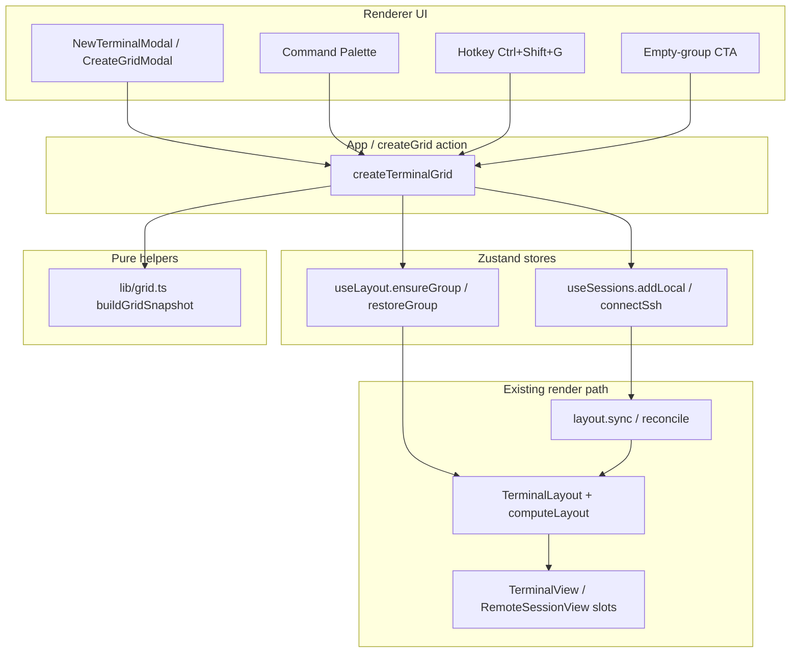
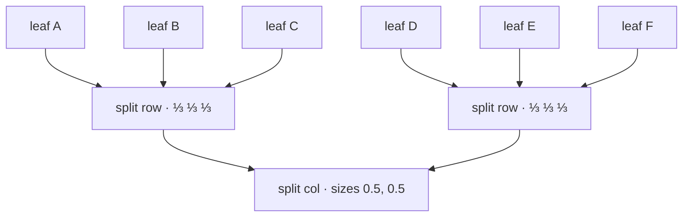
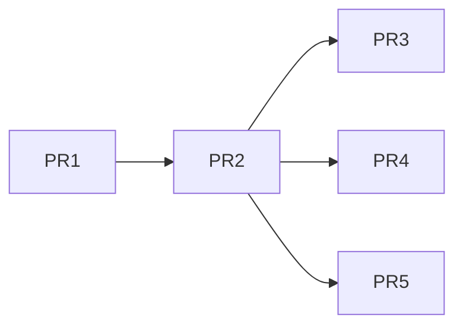

# Terminal Grid Creation

| Field | Value |
| --- | --- |
| **Title** | Terminal Grid Creation in DevTerm |
| **Author** | TBD |
| **Date** | 2026-07-09 |
| **Status** | Draft (revision 3 — post design review) |
| **Audience** | Senior engineers familiar with DevTerm layout, sessions, and workspaces |
| **Final repo path** | `plans/terminal-grid.md` |

## Where this document lives

After design consensus, copy this document into the DevTerm repository at:

**`plans/terminal-grid.md`**

(Create the `plans/` directory if it does not yet exist.) Keep the file out of runtime packages; it is engineering documentation only.

---

## Overview

Building an N×M pane arrangement in DevTerm today requires opening terminals one-by-one and repeatedly edge-dragging tabs into splits. That workflow does not scale past 2×2 and is easy to leave unbalanced.

This design adds a **first-class “Create grid” flow** that, in one action:

1. Creates `rows × cols` new sessions (local by default; optionally all on one saved SSH profile).
2. Places them in a **balanced nested split tree** using the existing `LayoutSnapshot` / `SplitNode` model.
3. Opens the result in a **new terminal group** (workspace-launch style), so existing sessions are never reparented, closed, or crushed into tabs.

No new layout node type is introduced. Grids are pure functions over session ids → `LayoutSnapshot`, applied via the existing `restoreGroup` path. Workspace capture/restore continues to work unchanged because the on-disk shape remains `leaf | split`.

---

## Background & Motivation

### Current state

The tiling model lives in [`src/renderer/store/layout.ts`](src/renderer/store/layout.ts):

- **`leaf`**: pane with `tabs: string[]` (session ids) and `active`.
- **`split`**: `dir: 'row' | 'col'`, `children: LayoutNode[]`, `sizes: number[]` (fractions summing to ~1). Despite the file header historically saying “binary split tree,” **the types and `computeLayout` are already n-ary** (any number of children). Drag-drop `drop()` always creates 2-child splits, but grids may create N-child equal splits. Optional cleanup when touching this area: reword the header comment to “split tree (n-ary).”
- **`groups`**: independent trees; default group id `default`.

[`TerminalLayout.tsx`](src/renderer/components/terminal/TerminalLayout.tsx) flattens trees with `computeLayout()` into absolute fractional rects and positions stable `.term-slot` DOM nodes. Sessions in inactive groups stay mounted but hidden — **reparenting/unmounting kills PTYs and SSH shells**.

Users already can:

| Action | Mechanism |
| --- | --- |
| Stack as tabs | Drop zone `center` → `drop()` |
| Split pane | Drop zones `left/right/top/bottom` → 50/50 split |
| Resize | Drag handles → `resize()` with **min fraction `0.18`** |
| Merge panes | `mergeLeaf()` |
| Move across groups | Group bar drag / `setGroup` |
| Save/restore arrangement | Workspaces (`captureWorkspace` / `toLiveSnapshot` / `restoreGroup`) |

New single terminals open via [`NewTerminalModal.tsx`](src/renderer/components/terminal/NewTerminalModal.tsx) → `addLocal` / `connectSsh` / `addBrowser` in [`sessions.ts`](src/renderer/store/sessions.ts). Hotkey: **Ctrl/Cmd+Shift+T** (`newTerminal` in [`hotkeys.ts`](src/renderer/lib/hotkeys.ts)).

### Pain points

1. **No bulk open + arrange**: N×M requires N×M opens and N×M−1 drag operations.
2. **Hard to keep equal sizes**: Manual splits accumulate uneven nested fractions.
3. **Workspace launch is the only bulk path**, but workspaces are *saved presets*, not an interactive “make a 2×2 now” tool.
4. **`reconcile()` stacks new sessions as tabs** on the active leaf. Creating multiple sessions without a follow-up `restoreGroup` always produces a single tab strip — never a grid.

### Related prior art in-repo

Workspace launch in [`WorkspacesManager.tsx`](src/renderer/components/workspaces/WorkspacesManager.tsx) is the closest pattern:

1. `ensureGroup` + flag metadata.
2. Open all sessions into that `groupId`.
3. After a short delay (so `sync`/reconcile has run), `restoreGroup(groupId, name, liveSnapshot)`.

Grid creation should deliberately mirror this sequence.

---

## Goals & Non-Goals

### Goals

1. **One-action grid**: User picks rows × cols (and cell kind) and gets a balanced grid.
2. **Respect the existing layout model**: Output is a normal `LayoutSnapshot`; no schema break for workspaces.
3. **Stable terminal slots**: Only create sessions and reposition slots; never reparent xterm DOM.
4. **Usable pane sizes**: Cap dimensions as **product policy** (comfort + process budget); engine can render any equal fraction (see Dimension limits).
5. **Workspace-compatible**: A group created as a grid can be saved as a workspace and relaunched with the same arrangement.
6. **Discoverable UX**: Entry points from New Terminal modal, command palette, hotkey, empty-group CTA, and optionally GroupBar.
7. **Incremental ship**: V1 = local-only new group; V1.1 = uniform SSH; later = optional in-place only for a truly empty **DEFAULT_GROUP**.
8. **Deterministic remote failure cleanup**: Failed SSH pending sessions must be closed so they never re-enter the layout via `sync`/`reconcile`.

### Non-Goals

| Non-goal | Rationale |
| --- | --- |
| First-class `grid` node in the layout tree | Would fork `computeLayout`, drag/drop, merge, resize, and workspace serialization |
| Rearrange *existing* sessions into a grid (V1) | Harder UX (which sessions? partial grids?); defer |
| Per-cell heterogeneous mix (local+SSH+browser matrix) in V1 | High UI complexity; uniform kind covers the main case |
| Changing binary-vs-n-ary resize semantics | Keep `resize` as-is (adjacent pair + min 0.18) |
| Auto-persisting grids as workspaces | User can Save group explicitly |
| Multiplexing many SSH sessions over one TCP client | Out of scope; each remote session owns one ssh2 client today |
| Agent-aware grid (auto-open agent panes) | Agent pane is per remote session UI, not a layout node |
| Touch/tablet-specific grid gestures | Desktop Electron only |

---

## Key Decisions

| # | Decision | Rationale |
| --- | --- | --- |
| K1 | **Synthesize nested/n-ary splits; do not add a `grid` node type** | Workspace snapshot, `computeLayout`, drop, merge, and resize all already understand `leaf \| split`. A `grid` type would be permanent dual maintenance for no runtime benefit after creation. |
| K2 | **Prefer n-ary equal splits per row/column** (`sizes: [1/n, …]`) | `SplitNode` already supports N children (drop creates pairs, but the type and `computeLayout` are n-ary). One split per row is flatter and more equal than a deep binary cascade. |
| K3 | **Outer direction = columns of rows** (`dir: 'col'` for rows, each child `dir: 'row'` for cells) | Matches row-major mental model (left→right, top→bottom) and matches how users describe “2×3” (2 rows, 3 cols). |
| K4 | **Always create *new* sessions for grid cells (V1)** | Clear product intent; avoids choosing/reordering existing PTYs. |
| K5 | **Always open grid in a *new group* (V1)** | Avoids `reconcile` re-injecting pre-existing group sessions as tabs after `restoreGroup`. Matches workspace launch isolation. |
| K6 | **Reuse `restoreGroup` + session-first create**, same as workspaces | Proven path; no new layout mutation primitive required for apply. |
| K7 | **Max 4×4 (16 cells) in V1 as product policy** | Not an engine invariant: `computeLayout` will paint equal `1/n` for any n. Cap is (1) **interactive resize comfort** — `resize()` only clamps adjacent pairs to min `0.18` on drag, so n≥6 starts sub-min and feels cramped; (2) **process budget** — 16 concurrent PTYs/SSH clients is a practical desktop ceiling. No confirm dialog at 16 for V1 (hard cap is enough). |
| K8 | **Uniform cell kind only in V1** (all local; V1.1 all same saved SSH) | One connection picker, one policy for failures; heterogeneous matrices deferred. |
| K9 | **Pure helper module `src/renderer/lib/grid.ts`** | Keeps tree math out of React/modals; unit-testable without Electron. |
| K10 | **No main-process / IPC / persistence schema changes for V1** | Grids are ephemeral layout ops; workspaces already persist the resulting tree. |
| K11 | **V1.1 remote: saved connections only** | Same constraint as workspaces (reconnect needs a stable `connectionId`). No ad-hoc ConnectionForm path inside Create Grid. |
| K12 | **V1 CreateGridModal: Local only; Remote shown disabled with “Coming soon”** | Avoid shipping a half-wired kind toggle; PR4 enables remote in place. |
| K13 | **V1 exposes no cwd UI** | Optional `cwd` may exist on the request type for future use; modal does not offer a directory picker. No inheritance from active session in V1. |
| K14 | **`createTerminalGrid` is pure-orchestration lib (no React)** | Lives in `src/renderer/lib/createGrid.ts`. App owns modal open state; palette/hotkey/empty CTA call the same lib or open the same modal. |
| K15 | **After restore, force `setActive(ids[0])`** | Each `addLocal`/`connectSsh` leaves `activeId` on the last created session while `restoreGroup` focuses the first leaf — reconcile that mismatch so file explorer / status bar match top-left. |
| K16 | **Remote failure path must `close()` failed pendings before final layout settle** | `connectSsh` keeps failed rows as `closed: true` sessions; `sync` does not filter closed. Closing removes them from the session list so reconcile cannot re-stack ghost tabs. |

---

## Proposed Design

### High-level architecture



### Sequence (local 2×2)

```mermaid
sequenceDiagram
  participant U as User
  participant M as CreateGridModal
  participant A as createTerminalGrid
  participant S as useSessions
  participant L as useLayout
  participant R as TerminalLayout

  U->>M: Choose 2×2, Local, Create
  M->>A: createTerminalGrid({rows:2, cols:2, kind:'local'})
  A->>L: createGroup("2×2")
  loop 4 times
    A->>S: addLocal({ groupId })
    S-->>A: sessionId
  end
  A->>A: buildGridSnapshot(ids, 2, 2)
  A->>L: restoreGroup(groupId, "2×2", snapshot)
  A->>S: setActive(ids[0])
  Note over S,L: Next App sync sees all ids already in tree → no tab restack
  L->>R: new tree, fresh leaf/split ids
  R->>R: computeLayout → 4 equal rects; slots repositioned (not remounted)
```

### Settle rules (local vs remote)

| Path | When to `restoreGroup` | Why |
| --- | --- | --- |
| **Local** | Same synchronous tick after all `addLocal` calls | Ids are final immediately. App’s `sessionKey` → `syncLayout` effect then runs against a tree that already contains those ids → reconcile add path is a no-op. **No `setTimeout`.** |
| **Remote (V1.1)** | After `Promise.all`, **close failed pendings**, then **explicit settle** before restore | N pendings are inserted before any await; intermediate React `sync` runs will stack all pendings as tabs (then 1:1 renames fix single completions). Concurrent multi-complete flushes can hit multi-remove/multi-add (reconcile only treats *exactly one* removed + *exactly one* added as rename). |

**Required remote settle sequence:**

1. `await Promise.all(connectSsh…)` — each call returns final id or `null`.
2. **Close every failed pending** still in the store (see Failure handling). Track temp ids so failures are closable.
3. Collect successful final ids.
4. **Either:**
   - **(Preferred)** Call `useLayout.getState().sync(...)` once with the **same session list shape App uses**, **then** `restoreGroup` in the **same tick** so the final tree wins without depending on React effects; **or**
   - **(Acceptable fallback)** Mirror workspace launch: `await` a short `setTimeout(0|80)` so pending effect flushes complete, then `restoreGroup`.
5. `setActive(okIds[0])` (and optionally `focusTerminal`).

**Critical: do not invent a `!s.closed` filter on the explicit `sync`.** App’s real effect is:

```ts
syncLayout(sessionsRef.map((s) => ({ id: s.id, groupId: s.groupId })))
// no closed filter
```

After grid create, **other groups** may still hold `markClosed` sessions (disconnect / shell exit without `close()`). An explicit `sync` that omits them removes those ids from **every** group tree for that call; the next App `sync` then re-`added`s them as tabs on each group’s active leaf — thrashing unrelated groups. Ghost-tab prevention for the **grid group** is already solved by **`close()` removing failed grid pendings from the store** (K16). The settle `sync` must therefore map **all remaining store sessions**, including any still-`closed` ones elsewhere:

```ts
// Match App — do NOT filter closed.
const all = useSessions
  .getState()
  .sessions.map((s) => ({ id: s.id, groupId: s.groupId }))
useLayout.getState().sync(all)
useLayout.getState().restoreGroup(groupId, name, snap)
```

**Expected intermediate state:** While SSH connects are in flight, the new group may briefly show a stack of pending tabs. That is fine; final restore overwrites topology. Do not try to suppress intermediate sync.

### Grid tree shape

For `rows = R`, `cols = C`, session ids in **row-major** order `ids[0..R*C)`:

```
if R == 1 && C == 1:
  leaf(ids[0])

if R == 1:
  split(dir=row, sizes=[1/C…], children=leaf each)

if C == 1:
  split(dir=col, sizes=[1/R…], children=leaf each)

else:
  split(dir=col, sizes=[1/R…], children=[
    for r in 0..R:
      split(dir=row, sizes=[1/C…], children=[
        leaf(ids[r*C + c]) for c in 0..C
      ])
  ])
```

Example **2×3**:



Each leaf holds **exactly one** session tab (`tabs: [sid]`, `active: sid`). Users can later stack more tabs into a cell via existing drag-to-center.

### Why not a `grid` node

| Concern | With synthetic splits | With first-class `grid` |
| --- | --- | --- |
| `computeLayout` | Unchanged | New branch + equal subdivision |
| Drag edge split / merge | Works | Must define grid cell split/merge |
| Workspace JSON | Unchanged | Schema migration + dual readers |
| After user resizes | Still a normal tree | Must either freeze grid symmetry or dissolve to splits |
| Focus mode / hidden groups | Unchanged | Unchanged if rendered as leaves |

After creation, the grid is **not special**. User resize, merge, and tab moves freely distort the tree — correct behavior.

### Dimension limits

Constants in `lib/grid.ts`:

```ts
export const GRID_MAX_ROWS = 4
export const GRID_MAX_COLS = 4
export const GRID_MAX_CELLS = 16 // defensive; rows*cols must also respect max
export const GRID_MIN_DIM = 1
```

**Product policy, not an engine invariant.** `computeLayout` will render equal fractions for any n (including 5 → `0.2`, 6 → `≈0.167`). The hard UI cap is justified by two separate concerns:

1. **Interactive resize comfort.** `resize()` in `layout.ts` clamps **adjacent pair** fractions to `min = 0.18` **only when the user drags** a handle — it does not reject initial layouts. For equal n-way splits, `1/n < 0.18` when `n ≥ 6`, so the first drag immediately hits the floor and peers feel “stuck.” At n=4, equal size is `0.25` with headroom. When implementing, prefer extracting a shared `RESIZE_MIN = 0.18` (or importing a named constant) rather than duplicating the magic number in grid validation docs only.
2. **Process budget.** Each cell is a real local PTY or a full ssh2 client + xterm. 16 concurrent new sessions is a practical desktop ceiling for V1; no extra confirm dialog at max (the cap is the guardrail).

UI should disable Create when invalid and show helper text: e.g. “Up to 4×4 (16 terminals).”

### Cell kinds

#### V1 — Local only

```ts
type GridCellKind = 'local'
```

Each cell: `addLocal({ groupId })`. **No cwd UI in V1** (K13). Request type may carry optional `cwd?: string` for callers/tests, but CreateGridModal does not expose it and does not inherit from the active session.

#### V1.1 — Uniform remote (saved connections only — K11)

```ts
type GridCellKind = 'local' | 'remote'
// when remote: require saved connectionId (no ad-hoc profile)
```

Each cell: `connectSsh(profile, { connectionId, groupId })` — **one ssh2 client per session** (existing architecture). Document cost: 2×2 remote = 4 concurrent SSH connections. Warn in UI when `cells > 4`.

In the V1 modal, show **Remote** as a disabled radio/segment with caption **“Coming soon”** (K12). PR4 enables it.

#### Explicitly deferred

- Browser cells in grids (webview-heavy; low demand for “browser grid”).
- Per-cell kind matrix.
- “Clone active session’s host into every cell” as a separate preset (can be a palette shortcut later: pre-fill remote from `activeId`).
- Shared cwd picker / inherit-from-active.

### Destination / group policy

| Mode | When | Behavior |
| --- | --- | --- |
| **New group** | **V1 default (always)** | `createGroup(\`${rows}×${cols}\`)`, open all sessions there, `restoreGroup`. Clears `focusedId` via `createGroup` — same as workspace isolation. |
| **In-place DEFAULT_GROUP** | Optional **PR5 only** | Allowed **only** when the active group is `DEFAULT_GROUP` **and** that group has **zero sessions of any status** in the session store (including `closed: true`). Aligns with App `sync`, which still feeds closed ids into `reconcile`. Do **not** use `root == null` (weak). Do **not** treat “only closed leftovers” as empty — those ids would re-stack onto a grid leaf after in-place `restoreGroup`. |
| Non-default empty group | **Out of scope** | `layout.sync` **drops non-default groups with zero session ids** (`if (ids.length === 0 && gid !== DEFAULT_GROUP) continue`). Empty non-default group tabs are not a durable product state (`createGroupAndLocal` always pairs group create with a session). Do not design in-place fill for them unless product later changes prune rules. |
| Active group non-empty | **Out of V1/PR5** | Would require closing others or including them in the snapshot — defer to “arrange existing” (Appendix C). |

**Emptiness helper (required if PR5 ships):**

Emptiness = **zero sessions with that `groupId` in the store**, with **no** `!s.closed` filter. Layout participants include closed rows until `close()` removes them. If product later wants “empty of live shells” semantics, PR5 must first `close()`/purge every closed member of DEFAULT before in-place apply — same end state as the strict zero-count rule.

```ts
/** True when no session (live or closed) is assigned to this group. */
function isGroupEmptyOfSessions(groupId: string): boolean {
  const gid = groupId || DEFAULT_GROUP
  return !useSessions
    .getState()
    .sessions.some((s) => (s.groupId || DEFAULT_GROUP) === gid)
}
```

Group name: `"2×2"`, `"3×2"`, etc. User can rename later if we add group rename (not required).

### Failure handling (SSH) — required close-out

`connectSsh` on failure **keeps** the pending session in the store with `closed: true` and returns `null`. App layout sync currently maps **all** sessions into `sync` **without filtering closed**:

```ts
syncLayout(sessionsRef.map((s) => ({ id: s.id, groupId: s.groupId })))
```

So after `restoreGroup` with only successful ids, the next reconcile treats failed pending ids as **`added`** and **deterministically stacks ghost tabs** on the active leaf. This is not an edge case; grids amplify it with N parallel connects. Workspace launch has a similar latent issue.

**Required steps in `createTerminalGrid` remote path (before final settle + restore):**

1. Track every pending/temp id created for the batch (or scan sessions in `groupId` with `closed === true` / `status` starting with `failed:` after `Promise.all`).
2. For each failed attempt: call `useSessions.getState().close(failedId)` so the session is **removed** from the store (not merely marked closed). Prefer `close` over leaving closed rows for layout to see.
3. Collect successful final session ids only.
4. If `successes.length === 0`:
   - Do **not** call `restoreGroup` with an empty/invalid snapshot.
   - If the group was newly created and now has zero live sessions, non-default groups will be pruned on the next sync — acceptable. Return errors to the modal.
5. If `0 < successes.length < rows*cols`: **`packIdsAsGrid(successes, cols)` only** — never call `buildGridSnapshot` with a short list.
6. If `successes.length === rows*cols`: `buildGridSnapshot(successes, rows, cols)`.
7. Run the remote settle sequence (explicit `sync` then `restoreGroup`, or short timeout — see Settle rules).
8. `setActive(successes[0])`.

**User-visible feedback (no toast subsystem):** `CreateGridResult` includes `errors: string[]`. The modal:

- **Total failure** (`created === 0`): keep modal open; show an error banner listing connection failures.
- **Partial success**: close modal (grid is usable) **or** close and show a one-line status in the modal’s last frame; preferred: keep a brief inline banner pattern by returning result to App and rendering a non-blocking note in the CreateGridModal footer before auto-close (~1.5s), or show the failure summary in the group’s first session `status` only for remotes that remain. **Simplest V1.1:** modal stays open on total failure with banner; on partial success, close modal and set a small `createGridNotice` string in App state rendered once above the group bar (ephemeral, dismiss on next navigation). Do **not** invent a general toast system.

Local grids should not fail mid-create (synchronous).

### Interaction with other features

| Feature | Interaction |
| --- | --- |
| **Focus mode** | Unaffected; magnifies one session slot as today |
| **Zen mode** | Group bar hidden; grid still works; entry via hotkey/palette |
| **Workspaces** | Save group after grid create → captures full split tree; launch restores |
| **Browser panes** | Not created by grid V1; can be dragged into a grid leaf later as a tab |
| **Agent panes** | Remote grid cells can open agent side panes independently; not part of layout tree |
| **File explorer** | Follows `sessions.activeId` — must match top-left after create (K15) |
| **OSC 7** | Each local/remote shell tracks cwd independently |
| **Inactive pane dimming** | Existing setting applies to non-active leaves |
| **Duplicate terminal** | Still single-session; no change |
| **Close group** | Closes all grid sessions (existing `closeGroup`) |
| **Focus / activeId** | After restore: `setActive(ids[0])` so session store matches first leaf from `restoreGroup` |

### Performance budget

| Metric | Target / note |
| --- | --- |
| Create 2×2 local | < 100 ms to restored layout (main thread) |
| Create 4×4 local | < 300 ms UI path; PTY spawn is async per TerminalView mount |
| Concurrent local PTYs | Up to 16 new + any pre-existing; document as soft limit |
| Concurrent SSH | Up to 16 connections — warn in UI when remote && cells > 4 |
| Memory | Each xterm + PTY is non-trivial; 16 is acceptable for power users |

Do **not** special-case unmount; keep mount-everything design. Large grids in background groups stay fitted via existing multi-group `computeLayout` in `TerminalLayout`.

---

## API / Interface Changes

### New pure module: `src/renderer/lib/grid.ts`

```ts
import type { LayoutSnapshot } from '../store/layout'

export const GRID_MAX_ROWS = 4
export const GRID_MAX_COLS = 4
export const GRID_MAX_CELLS = 16
export const GRID_MIN_DIM = 1

export interface GridSpec {
  rows: number
  cols: number
}

export function clampGridSpec(spec: GridSpec): GridSpec {
  const rows = Math.min(GRID_MAX_ROWS, Math.max(GRID_MIN_DIM, Math.floor(spec.rows)))
  const cols = Math.min(GRID_MAX_COLS, Math.max(GRID_MIN_DIM, Math.floor(spec.cols)))
  return { rows, cols }
}

export function gridCellCount(spec: GridSpec): number {
  const { rows, cols } = clampGridSpec(spec)
  return rows * cols
}

/** Validate before create; returns error message or null. */
export function validateGridSpec(spec: GridSpec): string | null {
  if (!Number.isFinite(spec.rows) || !Number.isFinite(spec.cols)) return 'Invalid dimensions'
  if (spec.rows < GRID_MIN_DIM || spec.cols < GRID_MIN_DIM) return 'Minimum is 1×1'
  if (spec.rows > GRID_MAX_ROWS || spec.cols > GRID_MAX_COLS) {
    return `Maximum is ${GRID_MAX_ROWS}×${GRID_MAX_COLS}`
  }
  if (spec.rows * spec.cols > GRID_MAX_CELLS) return `Maximum ${GRID_MAX_CELLS} terminals`
  return null
}

/**
 * Build a LayoutSnapshot placing session ids in row-major order.
 * **Strict:** throws if `ids.length !== rows * cols`.
 * Partial SSH success must use `packIdsAsGrid` only — never this function with a short list
 * (short lists would emit empty row children / `equalSizes(0)` and poison `computeLayout`/`prune`).
 */
export function buildGridSnapshot(
  ids: string[],
  rows: number,
  cols: number
): LayoutSnapshot {
  const expected = rows * cols
  if (ids.length !== expected) {
    throw new Error(
      `buildGridSnapshot: expected ${expected} ids (rows=${rows} cols=${cols}), got ${ids.length}`
    )
  }
  if (rows === 1 && cols === 1) {
    return leafOf(ids[0])
  }
  if (rows === 1) {
    return {
      type: 'split',
      dir: 'row',
      sizes: equalSizes(cols),
      children: ids.map(leafOf)
    }
  }
  if (cols === 1) {
    return {
      type: 'split',
      dir: 'col',
      sizes: equalSizes(rows),
      children: ids.map(leafOf)
    }
  }
  const rowNodes: LayoutSnapshot[] = []
  for (let r = 0; r < rows; r++) {
    const slice = ids.slice(r * cols, r * cols + cols)
    rowNodes.push({
      type: 'split',
      dir: 'row',
      sizes: equalSizes(cols),
      children: slice.map(leafOf)
    })
  }
  return {
    type: 'split',
    dir: 'col',
    sizes: equalSizes(rows),
    children: rowNodes
  }
}

/** Pack n ids into a near-grid when some SSH cells failed. */
export function packIdsAsGrid(ids: string[], preferredCols: number): LayoutSnapshot | null {
  if (!ids.length) return null
  const cols = Math.min(preferredCols, GRID_MAX_COLS, ids.length)
  const rows = Math.ceil(ids.length / cols)
  // Last row may be short — build row by row with variable width.
  const rowNodes: LayoutSnapshot[] = []
  let i = 0
  for (let r = 0; r < rows; r++) {
    const take = Math.min(cols, ids.length - i)
    const slice = ids.slice(i, i + take)
    i += take
    rowNodes.push(
      slice.length === 1
        ? leafOf(slice[0])
        : { type: 'split', dir: 'row', sizes: equalSizes(slice.length), children: slice.map(leafOf) }
    )
  }
  if (rowNodes.length === 1) return rowNodes[0]
  return { type: 'split', dir: 'col', sizes: equalSizes(rowNodes.length), children: rowNodes }
}

function leafOf(id: string): LayoutSnapshot {
  return { type: 'leaf', tabs: [id], active: id }
}

function equalSizes(n: number): number[] {
  return Array.from({ length: n }, () => 1 / n)
}
```

### New orchestration helper: `src/renderer/lib/createGrid.ts`

Lib-only (no React — K14). App owns modal open state and any ephemeral notice UI.

```ts
export type CreateGridRequest = {
  rows: number
  cols: number
  kind: 'local' | 'remote'
  /** Required when kind === 'remote' (saved connection only — K11) */
  connectionId?: string
  /**
   * Optional shared start directory for callers/tests.
   * V1 modal does not expose this (K13).
   */
  cwd?: string
  /**
   * Default true. V1 always passes true / omits (new group).
   * PR5 may pass false only when destination is empty DEFAULT_GROUP
   * (see `resolveGridGroupId`).
   */
  newGroup?: boolean
  groupName?: string
}

export type CreateGridResult = {
  groupId: string
  sessionIds: string[]
  requested: number
  created: number
  /** Human-readable failure lines for modal banner / notice (SSH). */
  errors: string[]
}

export async function createTerminalGrid(req: CreateGridRequest): Promise<CreateGridResult>
```

Implementation sketch (explicit control flow — no cryptic ternaries):

```ts
function resolveGridGroupId(
  req: CreateGridRequest,
  rows: number,
  cols: number
): string {
  const layout = useLayout.getState()
  const name = req.groupName ?? `${rows}×${cols}`
  const wantNew = req.newGroup !== false // default true

  if (wantNew) {
    return layout.createGroup(name)
  }

  // PR5 only: in-place for empty DEFAULT_GROUP via session membership, not root==null
  const activeId = layout.activeGroupId
  if (
    activeId === DEFAULT_GROUP &&
    isGroupEmptyOfSessions(DEFAULT_GROUP)
  ) {
    return activeId
  }

  // Fall back to new group rather than corrupting a non-empty / non-default group
  return layout.createGroup(name)
}

export async function createTerminalGrid(req: CreateGridRequest): Promise<CreateGridResult> {
  const err = validateGridSpec(req)
  if (err) throw new Error(err)
  const { rows, cols } = clampGridSpec(req)
  const n = rows * cols
  const name = req.groupName ?? `${rows}×${cols}`
  const groupId = resolveGridGroupId(req, rows, cols)
  const sessions = useSessions.getState()
  const layout = useLayout.getState()
  const errors: string[] = []

  if (req.kind === 'local') {
    const ids: string[] = []
    for (let i = 0; i < n; i++) {
      ids.push(sessions.addLocal({ cwd: req.cwd, groupId }))
    }
    const snap = buildGridSnapshot(ids, rows, cols) // strict length
    layout.restoreGroup(groupId, name, snap)
    sessions.setActive(ids[0])
    return { groupId, sessionIds: ids, requested: n, created: ids.length, errors }
  }

  // remote — V1.1 only (PR4). V1 should not call kind:'remote'.
  if (!req.connectionId) throw new Error('connectionId required for remote grids')
  const conns = await window.devterm.connections.list()
  const c = conns.find((x) => x.id === req.connectionId)
  if (!c) throw new Error('Saved connection not found')
  const { id: _id, name: _name, ...profile } = c

  // Track pre-await session ids in this group so failures can be closed.
  const before = new Set(sessions.sessions.map((s) => s.id))

  const results = await Promise.all(
    Array.from({ length: n }, () =>
      useSessions.getState().connectSsh(profile, {
        connectionId: c.id,
        startCwd: req.cwd,
        groupId
      })
    )
  )

  // Close failed pendings (closed:true still in store) so reconcile cannot restack them.
  const after = useSessions.getState().sessions
  for (const s of after) {
    if (s.groupId !== groupId && (s.groupId || DEFAULT_GROUP) !== groupId) continue
    if (s.closed || (typeof s.status === 'string' && s.status.startsWith('failed'))) {
      useSessions.getState().close(s.id)
      errors.push(s.status ?? `failed: ${s.id}`)
    }
  }
  // Also close any brand-new ids that never made it to success list
  void before // used if implementers prefer diff-based close of non-ok results

  const ok = results.filter((x): x is string => !!x)
  if (ok.length === 0) {
    return { groupId, sessionIds: [], requested: n, created: 0, errors }
  }

  const snap =
    ok.length === n ? buildGridSnapshot(ok, rows, cols) : packIdsAsGrid(ok, cols)

  // Preferred settle: explicit sync matching App's shape (ALL sessions, no
  // !closed filter), then restore in the same tick. Filtering closed would
  // drop markClosed sessions in *other* groups and thrash their trees on the
  // next App sync. Ghost tabs in *this* group are already gone via close().
  const all = useSessions
    .getState()
    .sessions.map((s) => ({ id: s.id, groupId: s.groupId }))
  useLayout.getState().sync(all)
  if (snap) {
    useLayout.getState().restoreGroup(groupId, name, snap)
  }
  useSessions.getState().setActive(ok[0])

  if (ok.length < n && errors.length === 0) {
    errors.push(`Only ${ok.length} of ${n} SSH sessions connected`)
  }

  return { groupId, sessionIds: ok, requested: n, created: ok.length, errors }
}
```

**No changes** to `src/shared/types.ts`, preload, or main IPC for V1.

### Layout store

No new store methods required if orchestration uses:

- `createGroup(name?)`
- `restoreGroup(id, name, snap)`

Optional later convenience (not required):

```ts
applySnapshotToGroup(groupId: string, snap: LayoutSnapshot): void
```

identical to `restoreGroup` without forcing `activeGroupId` (already sets active — desired).

### UI components

#### 1. Extend `NewTerminalModal` **or** nested `CreateGridModal`

**Recommended:** keep `NewTerminalModal` as a four-choice picker and open a second modal for grid options (mirrors Local → done, Remote → ConnectionForm).

```
New tab
┌──────────┬──────────┐
│  Local   │  Remote  │
├──────────┼──────────┤
│ Browser  │  Grid    │  ← new choice
└──────────┴──────────┘
```

**Picker CSS:** Today `.nt-choices` in `src/renderer/styles/panels.css` is a horizontal `display: flex` for **three** cards. Four choices will squeeze. PR2 **must** change `.nt-choices` to a **2×2 CSS grid** (e.g. `display: grid; grid-template-columns: 1fr 1fr; gap: …`). Motion stagger in `src/renderer/styles/motion.css` currently targets `.nt-choice:nth-child(2|3)` — **add nth-child(4)** so the Grid card enters consistently.

`CreateGridModal.tsx`:

- Prefer wrapping with existing **`ModalShell`** ([`src/renderer/components/common/ModalShell.tsx`](src/renderer/components/common/ModalShell.tsx)) for Escape handling and size consistency with other chrome modals (NewTerminalModal itself is still a bespoke backdrop; new modal should prefer ModalShell).
- Preset chips: `2×2`, `2×3`, `3×3`, `4×2`, Custom.
- Steppers or number inputs for rows / cols (1–4).
- Live preview: CSS grid of empty cells (not real terminals) using theme CSS variables.
- Kind: **Local** (default). **Remote** control visible but **disabled** with “Coming soon” until PR4 (K12).
- Connection dropdown when Remote is enabled (PR4); saved connections only (K11).
- Warning when `kind==='remote' && cells > 4`: “Opens N separate SSH connections.”
- Error banner region for total/partial SSH failures (`result.errors`).
- Primary button: **Create grid**
- Cancel

#### 2. Command palette

Add a synthetic action item (not a snippet):

- Query matches: `grid`, `split`, `2x2`, `new grid`
- On run → open `CreateGridModal` (App sets `showGrid`).

Palette today is snippets/connections/workspaces/history only ([`CommandPalette.tsx`](src/renderer/components/modals/CommandPalette.tsx)). Smallest change: open grid modal from a new **Actions** category or inject a static item in `all`. Optional later: parse `grid 2x2` for one-shot create without modal.

#### 3. Hotkey

In [`hotkeys.ts`](src/renderer/lib/hotkeys.ts):

```ts
| 'newGrid'
// ...
{ id: 'newGrid', mod: true, shift: true, key: 'g', label: 'New terminal grid' },
```

Wire in `App.tsx` keydown switch → `setShowGrid(true)` + `setView('terminals')`.

Does **not** conflict with existing bindings (verified). Respect custom keybindings map in settings the same way as other ids. `ShortcutsModal` maps `resolveHotkeys` and filters aliases — listing is automatic once `HOTKEYS` gains the entry.

#### 4. Empty-group CTA

In [`TerminalsView.tsx`](src/renderer/components/chrome/TerminalsView.tsx) empty overlay, add secondary button:

**Create grid…** → opens `CreateGridModal`. V1 always creates a **new group**. Do not pass `newGroup: false` until PR5 (empty DEFAULT_GROUP only). The empty overlay for non-default groups is rare/transient because sync prunes empty non-default groups; CTA still opens the modal safely under V1 policy.

#### 5. GroupBar (optional V1)

Small “grid” icon button near group-new (`+`) is easy to miss and cluttered; **defer** unless empty CTA + modal + hotkey prove insufficient. Prefer not adding GroupBar chrome in V1.

### Styles

Modal styles live in **`src/renderer/styles/panels.css`** (`.new-term-modal`, `.nt-choices`, etc.). Root `src/renderer/styles.css` only `@import`s partials — **do not** dump new rules into the root file body.

PR2 should edit:

| File | Changes |
| --- | --- |
| `src/renderer/styles/panels.css` | `.nt-choices` → 2×2 grid; new `.create-grid-modal`, `.grid-presets`, `.grid-preview`, `.grid-preview-cell`, error banner styles |
| `src/renderer/styles/motion.css` | Stagger delay for `.nt-choice:nth-child(4)`; any preview motion behind reduced-motion |

Rules:

- Use `var(--…)` / `color-mix` only; no hardcoded palette
- Animate opacity/transform only; honor `prefers-reduced-motion`

---

## Data Model Changes

### Runtime

None beyond in-memory layout trees already described by `LayoutNode` / `LayoutSnapshot`.

### Persistence

| Store | Change |
| --- | --- |
| `workspaces.json` | None — saving a grid group already serializes nested splits via `snapshotNode` |
| `settings.json` | Optional later: `lastGridSpec: { rows, cols }` for modal defaults — **not V1** |
| `connections.json` / snippets | None |

### Migration

None. No version bump of workspace schema.

---

## Alternatives Considered

### A1. First-class `grid` layout node

```ts
| { type: 'grid'; rows: number; cols: number; cells: string[]; sizes?: … }
```

**Pros:** Preserves semantic “this is a grid”; could re-equalize sizes.  
**Cons:** Touches `computeLayout`, drop targets, merge, workspace types, prune, every walker; after any manual split the node must dissolve or block edits.  
**Verdict:** Rejected (K1).

### A2. Only document a workspace template “2×2 locals”

**Pros:** Zero new UI code.  
**Cons:** Not interactive; user must save/launch workspaces; still no path to “3×2 of this SSH host now.”  
**Verdict:** Insufficient as product answer; workspaces remain complementary.

Related rejected variant: a command that **auto-saves a one-shot workspace and immediately launches it** would reuse more of `WorkspacesManager` but is worse UX (pollutes the workspace list, async file I/O for an ephemeral layout, same session cost without a dedicated flow). Prefer direct `createTerminalGrid` over workspace side-effects.

### A3. Deep binary cascade only (no n-ary)

e.g. (((A|B)|(C|D))) for 2×2.

**Pros:** Matches what drag-drop produces today (`drop()` always builds 2-child splits).  
**Cons:** Worse equality under later resize; deeper trees; harder to read in debug. **Note:** `SplitNode` / `computeLayout` are already n-ary — binary is only the drag-drop construction habit, not a type limit.  
**Verdict:** Prefer n-ary equal splits (K2); drag-drop can stay binary.

### A4. Redistribute existing sessions into a grid

**Pros:** Useful “tidy my group” feature.  
**Cons:** Selection UX, ordering, leftover tabs, partial groups.  
**Verdict:** Defer to V2 as `arrangeGroupAsGrid(groupId, rows, cols)` using `allLeaves` tab order.

### A5. Replace active group content in place (always)

**Pros:** Fewer group tabs.  
**Cons:** Surprising destruction or reconcile tab-stacking bugs with existing sessions.  
**Verdict:** New group default (K5); empty-group in-place is optional stretch.

### A6. Main-process “batch PTY create” IPC

**Pros:** One round-trip.  
**Cons:** Unnecessary; renderer already creates PTYs lazily when `TerminalView` mounts; batching buys little.  
**Verdict:** Rejected for V1.

---

## Security & Privacy Considerations

| Topic | Assessment |
| --- | --- |
| **Threat model** | Feature is local UI orchestration; no new network surface in V1. |
| **SSH** | V1.1 opens N connections with the same saved credentials already available to one-shot connect; no new secret storage. Warn user about connection count (resource / server max-sessions). |
| **Host keys** | Each `connectSsh` uses existing TOFU `knownHosts` path; N connects to same host reuse trust. |
| **Agent / MCP** | Unchanged; grid does not open agent panes. |
| **Path / cwd** | Optional shared cwd is user-controlled; same as single `addLocal({ cwd })`. |
| **Persistence** | No secrets in grid helpers; workspace save still strips ad-hoc SSH without `connectionId`. |

---

## Observability

DevTerm has no production metrics pipeline and **no general toast UI**. V1 operability is intentionally light:

1. **`console.debug` in dev** when creating a grid: `{ rows, cols, kind, groupId, created, ms }`.
2. **Modal / App notice** from `CreateGridResult.errors` (SSH total/partial failure — see Failure handling). Not a toast subsystem.
3. **Session status strings** only while a failed row still exists; after required `close()`, those rows are gone — modal banner is the operator-facing channel.
4. **Optional future:** anonymized telemetry — out of scope.

Manual QA checklist (copy into PR templates):

- [ ] 2×2 local: four equal panes, all shells alive after group switch away/back  
- [ ] 1×4 and 4×1 degenerate cases  
- [ ] 4×4 local: all 16 slots, no xterm detach  
- [ ] Save group as workspace → launch → same topology  
- [ ] Drag tab between grid cells / merge leaf still works  
- [ ] Focus mode on a grid cell  
- [ ] Resize handle between cells respects 0.18 min (product comfort; initial equal sizes may differ)  
- [ ] Hotkey + modal + empty CTA entry points  
- [ ] After create, active session / file explorer = **top-left** cell (`ids[0]`)  
- [ ] Remote 2×2 (PR4): four SSH sessions  
- [ ] Remote partial/total failure: **no ghost tabs** after restore; modal shows errors; failed pendings closed  
- [ ] `npm run test:grid` green (PR1 harness)  

---

## Rollout Plan

### Phases

| Phase | Scope | Ship gate |
| --- | --- | --- |
| **PR1** | `lib/grid.ts` + mirrored `scripts/assert-grid.mjs` + `npm run test:grid` | Shapes 1×1, 2×2, 3×2, 1×4, 4×1, packIds, **length-mismatch throws**; reviewer diffs `.mjs` vs `grid.ts` |
| **PR2** | Local-only `createTerminalGrid` + CreateGridModal + NewTerminalModal 2×2 picker + panels/motion CSS | Manual QA local grids; **no remote code paths** |
| **PR3** | Hotkey, empty-group CTA, palette action | Discoverability complete |
| **PR4** | Remote grids + **close failed pendings** + settle + modal errors | Manual QA SSH + **no ghost tabs** |
| **PR5** (optional) | Empty **DEFAULT_GROUP** in-place only; last-used dimensions | Polish |

### Feature flag

Not required if gated by release version. If desired for staged desktop builds:

```ts
// settings or compile-time
enableTerminalGrid: true
```

Default **on** in development; production on once PR2 QA passes.

### Rollback

- Revert UI entry points first (modal choice / hotkey) if regressions.
- Pure `lib/grid.ts` is inert without callers.
- No data migration to reverse.
- Users with saved workspaces from grid groups remain valid (plain splits).

### Risks

| Risk | Severity | Mitigation |
| --- | --- | --- |
| Race: `sync` stacks tabs after `restoreGroup` overwrites | Medium | Locals: same-tick create + restore. Remote: close failures + explicit `sync(all sessions)` then `restoreGroup` (or short timeout fallback) |
| Failed SSH ghost tabs via reconcile | **High** | Required `close()` of failed pendings before settle (K16); QA checklist |
| Explicit settle filters `closed` and thrashs other groups | **High** | Settle `sync` must match App (all sessions, no `!closed` filter). Grid ghosts solved by store removal only |
| Concurrent multi-rename before restore | Medium | Explicit post-await settle; intermediate tab stack is expected and overwritten |
| Too many PTYs freezes UI | Medium | Hard cap 4×4 (no confirm dialog) |
| Too many SSH sessions denied by server | Medium | UI warning when cells > 4; partial pack + modal errors |
| User expects grid to stay “locked” equal | Low | Document: grid is initial layout only; resize freely |
| Group tab proliferation | Low | Naming `2×2`; user closes group like any other |
| `restoreGroup` clears `focusedId` | Low | Acceptable; same as workspace launch |
| `activeId` vs first leaf mismatch | Low | K15 `setActive(ids[0])` after restore |

---

## Open Questions

Resolved into Key Decisions where possible (K7, K11–K16). Remaining product polish only:

1. **Should 2×2 local be a one-click palette command** without opening the modal? (Default proposal: open modal; optional later.)
2. **Group naming for remote:** always `R×C`, or include host/connection name (`prod 2×2`)?
3. **Do we want “arrange existing group as grid”** in the same modal as a second tab, or a completely separate command later? (Appendix C; not V1.)
4. **Partial-success notice surface:** App ephemeral `createGridNotice` above group bar vs modal auto-close with footer line — implementer may pick either if both meet “no toast system.”

---

## References

| Resource | Path / note |
| --- | --- |
| Layout store | `src/renderer/store/layout.ts` (`LeafNode`, `SplitNode`, `computeLayout`, `restoreGroup`, `resize` min 0.18) |
| Terminal layout UI | `src/renderer/components/terminal/TerminalLayout.tsx` |
| Sessions | `src/renderer/store/sessions.ts` (`addLocal`, `connectSsh`, `addBrowser`) |
| Workspace capture/restore | `src/renderer/lib/workspace.ts`, `src/renderer/components/workspaces/WorkspacesManager.tsx` |
| Workspace types | `src/shared/types.ts` (`WorkspaceLayoutNode`, `WorkspaceItem`) |
| New terminal picker | `src/renderer/components/terminal/NewTerminalModal.tsx` |
| Modal shell | `src/renderer/components/common/ModalShell.tsx` |
| Panel / modal styles | `src/renderer/styles/panels.css`, `src/renderer/styles/motion.css` |
| Group bar | `src/renderer/components/chrome/GroupBar.tsx` |
| Terminals view / empty state | `src/renderer/components/chrome/TerminalsView.tsx` |
| Hotkeys | `src/renderer/lib/hotkeys.ts` |
| App orchestration | `src/renderer/App.tsx` |
| Product rules | `AGENTS.md` |

### Critical product rules this design obeys

- Terminals stay mounted; grid only changes layout tree + creates sessions.
- No xterm reparenting; `restoreGroup` assigns new leaf ids but sessions keep the same React slot keys (`session.id`).
- Workspaces remain the persistence path for arrangements.
- Theme via CSS variables; no scale animations on terminals.

---

## PR Plan

Incremental, independently reviewable merge sequence. Each PR should pass `npm run typecheck` and `npm run lint`. Order: **PR1 → PR2 → (PR3 ∥ PR4 ∥ PR5)**.

### PR 1 — Grid snapshot pure library + assert harness

| Field | Detail |
| --- | --- |
| **Title** | `feat(layout): add pure grid snapshot builder` |
| **Files / components** | `src/renderer/lib/grid.ts` (new); `scripts/assert-grid.mjs` (new); `package.json` script `test:grid` |
| **Dependencies** | None |
| **Description** | Implement `buildGridSnapshot` (**throws** if `ids.length !== rows*cols`), `packIdsAsGrid`, `validateGridSpec`, dimension constants. **No vitest/jest/tsx** — the repo has no unit test runner and renderer TS is not a Node package export. **Chosen harness strategy (locked):** `scripts/assert-grid.mjs` is a **mirrored pure-JS implementation** of the same algorithms + assert cases. File header comment: `// Keep in sync with src/renderer/lib/grid.ts — PR1 reviewers must diff logic against grid.ts.` Wire **`"test:grid": "node scripts/assert-grid.mjs"`**. Do **not** depend on `node --experimental-strip-types`, `tsx`, or `out/` electron-vite bundles (those are not guaranteed in this repo’s toolchain). Cover 1×1, 2×2, 3×2, 1×4, 4×1, partial pack, and **rejection on length mismatch**. Optional: reword `layout.ts` header “binary” → “n-ary split tree” when convenient. No UI. Ship gate: `npm run test:grid` + typecheck. |

### PR 2 — Local orchestration + CreateGridModal (no remote paths)

| Field | Detail |
| --- | --- |
| **Title** | `feat(terminals): create local terminal grids in a new group` |
| **Files / components** | `src/renderer/lib/createGrid.ts` (new); `src/renderer/components/terminal/CreateGridModal.tsx` (new, prefer `ModalShell`); `src/renderer/components/terminal/NewTerminalModal.tsx`; `src/renderer/App.tsx`; `src/renderer/styles/panels.css`; `src/renderer/styles/motion.css` |
| **Dependencies** | PR 1 |
| **Description** | **Local only** — throw if `kind !== 'local'`. New group always; same-tick `restoreGroup` + `setActive(ids[0])`. Grid choice in New Terminal modal with **2×2 `.nt-choices` layout** + 4th-card motion stagger. CreateGridModal: presets, steppers, CSS preview; Remote disabled “Coming soon”. Manual QA 2×2 / 4×4. Optional later split into headless create vs modal UI — not mandatory. |

### PR 3 — Discoverability (hotkey, empty CTA, palette)

| Field | Detail |
| --- | --- |
| **Title** | `feat(terminals): grid entry points — hotkey, palette, empty state` |
| **Files / components** | `src/renderer/lib/hotkeys.ts`; `src/renderer/App.tsx`; `src/renderer/components/chrome/TerminalsView.tsx`; `src/renderer/components/modals/CommandPalette.tsx` |
| **Dependencies** | PR 2 |
| **Description** | Add `newGrid` hotkey (Ctrl/Cmd+Shift+G; no conflict). Empty-group “Create grid…” button. Palette action “Create terminal grid…”. ShortcutsModal auto-lists from `HOTKEYS`. |

### PR 4 — Uniform remote (SSH) grids + failure close-out

| Field | Detail |
| --- | --- |
| **Title** | `feat(terminals): create SSH grids from a saved connection` |
| **Files / components** | `src/renderer/lib/createGrid.ts`; `CreateGridModal.tsx`; App ephemeral notice if used |
| **Dependencies** | PR 2 (PR 3 optional parallel). **Requires Issue 1 failure close-out design (now specified).** |
| **Acceptance criteria** | (1) Saved-connection-only remote; (2) **`close()` every failed pending** before settle; (3) preferred explicit `sync(all sessions, no closed filter)` + `restoreGroup` same tick (or timeout fallback) — must match App’s sync shape; (4) `packIdsAsGrid` on partial success only; (5) modal total-failure banner + partial notice; (6) **no ghost tabs** in the grid group; (7) connection-count warning when cells > 4; (8) `setActive(ok[0])`; (9) settle must **not** reshuffle other groups’ closed tabs. |

### PR 5 — (Optional) Empty DEFAULT_GROUP in-place + last-size polish

| Field | Detail |
| --- | --- |
| **Title** | `feat(terminals): apply grid to empty default group; remember last size` |
| **Files / components** | `createGrid.ts` (`resolveGridGroupId` / `isGroupEmptyOfSessions`); `CreateGridModal.tsx`; optionally `src/renderer/store/settings.ts` |
| **Dependencies** | PR 2 |
| **Description** | In-place **only** when active group is `DEFAULT_GROUP` and **zero sessions of any status** share that groupId (`isGroupEmptyOfSessions` with **no** `!closed` filter) — **not** `root == null`, **not** non-default empty groups (sync prunes them). Closed leftovers block in-place until purged via `close()`. Persist last `{ rows, cols }` for modal defaults. |

### Suggested merge order



PR 3, PR 4, and PR 5 can proceed in parallel after PR 2 lands.

---

## Appendix A — Worked example: 2×2 local snapshot

Session ids `local-a`, `local-b`, `local-c`, `local-d` in row-major order:

```json
{
  "type": "split",
  "dir": "col",
  "sizes": [0.5, 0.5],
  "children": [
    {
      "type": "split",
      "dir": "row",
      "sizes": [0.5, 0.5],
      "children": [
        { "type": "leaf", "tabs": ["local-a"], "active": "local-a" },
        { "type": "leaf", "tabs": ["local-b"], "active": "local-b" }
      ]
    },
    {
      "type": "split",
      "dir": "row",
      "sizes": [0.5, 0.5],
      "children": [
        { "type": "leaf", "tabs": ["local-c"], "active": "local-c" },
        { "type": "leaf", "tabs": ["local-d"], "active": "local-d" }
      ]
    }
  ]
}
```

After `buildSnapshot` inside `restoreGroup`, each node receives a fresh runtime `id` (`leaf-…`, `split-…`). Session ids in `tabs` are unchanged.

## Appendix B — Race analysis: locals, remote renames, and failed pendings

### What `restoreGroup` and `reconcile` do

- `restoreGroup` **replaces** the group tree wholesale with a fresh snapshot (new leaf/split node ids; session ids in `tabs` unchanged).
- App’s effect maps **all** store sessions into `layout.sync` (today **without** filtering `closed`).
- `reconcile` then: removes missing ids, adds unknown ids as tabs on the active leaf, and treats **exactly one** removed + **exactly one** added as an in-place rename (pending → real SSH id).

### Local grids

`addLocal` returns final ids synchronously. Create all cells, `buildGridSnapshot`, `restoreGroup`, `setActive(ids[0])` in **one tick**. The next React sync sees every id already present → no restack. **No `setTimeout`.**

### Remote grids — intermediate stack is expected

N pendings are inserted before any await. Intermediate sync runs stack all pendings as tabs; single completions rename 1:1. Concurrent multi-complete flushes can multi-remove/multi-add and reshuffle before final restore. **Do not suppress this.** After `Promise.all`:

1. **`close()` failed pendings** (they remain in the store as `closed: true` otherwise → deterministic ghost tabs). Removal from the store is what prevents grid ghost tabs — not filtering closed at sync time.
2. Preferred: `sync(allSessions)` with the **same shape as App** (map every store session to `{ id, groupId }` — **no `!closed` filter**), then `restoreGroup` **same tick**. Filtering closed would thrash other groups that still hold `markClosed` rows.
3. Fallback: short `setTimeout(0|80)` like workspace launch, then `restoreGroup`.
4. `setActive(ok[0])`.

### Failed sessions are not “user will close tabs”

Leakage is deterministic if close-out is skipped. Design treats close-out as a **hard requirement** of PR4, not best-effort.

### Implementer checklist before merging remote grids

- [ ] No `closed: true` sessions remain in the grid’s group after create returns  
- [ ] Snapshot tab set equals successful id set  
- [ ] Partial path never calls `buildGridSnapshot` with wrong length  
- [ ] Top-left is active  
- [ ] Total failure leaves no usable empty group tree (no bogus restore)

## Appendix C — Future: arrange existing sessions

```ts
function arrangeGroupAsGrid(groupId: string, rows: number, cols: number): void {
  const g = useLayout.getState().groups.find((x) => x.id === groupId)
  if (!g?.root) return
  const ids = allLeaves(g.root).flatMap((l) => l.tabs) // document order
  const n = rows * cols
  // take first n, leave remainder as extra tabs on last cell or reject
  const snap = buildGridSnapshot(ids.slice(0, n), rows, cols)
  // remainder handling TBD
  useLayout.getState().restoreGroup(groupId, g.name, snap)
}
```

Out of V1; listed so implementers do not invent conflicting APIs later.
